.. -*- encoding: utf-8 -*-

==========================
Liquid Drops and Globules
==========================

.. meta::
    :PG.Id: 37939
    :PG.Title: Liquid Drops and Globules
    :PG.Released: 2011-11-05
    :PG.Rights: Public Domain
    :PG.Producer: Chris Curnow
    :PG.Producer: Enrico Segre
    :PG.Producer: the Online Distributed Proofreading Team at http://www.pgdp.net
    :PG.Credits: This file was produced from images generously made available by The Internet Archive.
    :DC.Creator: Chas. R. Darling
    :DC.Title: Liquid Drops and Globules, their Formation and Movements
    :DC.Language: en
    :DC.Created: 1914
    :coverpage: images/cover.jpg

.. _pg-header:

.. container:: pgheader language-en

   .. style:: paragraph
      :class: noindent

   This eBook is for the use of anyone anywhere at no cost and with
   almost no restrictions whatsoever. You may copy it, give it away or
   re-use it under the terms of the `Project Gutenberg License`_
   included with this eBook or online at
   http://www.gutenberg.org/license.

   

   |

   .. _pg-machine-header:

   .. container::

      Title: Liquid Drops and Globules, their Formation and Movements
      
      Author: Chas. R. Darling
      
      Release Date: November 05, 2011 [EBook #37939]
      
      Language: English
      
      Character set encoding: UTF-8

      |

      .. _pg-start-line:

      \*\*\* START OF THIS PROJECT GUTENBERG EBOOK LIQUID DROPS AND GLOBULES \*\*\*

   |
   |
   |
   |

   .. _pg-produced-by:

   .. container::

      Produced by Chris Curnow, Enrico Segre, and the Online Distributed Proofreading Team at http://www.pgdp.net.

      |

      This file was produced from images generously made available by The Internet Archive.


.. role:: small-caps
   :class: small-caps

.. role:: small
   :class: small

.. role:: antiqua
   :class: antiqua

.. ..

.. style:: title
   :class: center large

.. style:: subtitle
   :class: center large

.. we have only one subtitle, LECTURE I, which cannot be a title. We can make
   it as large as the other LECTUREs, but not bold otherwise we'll have
   a stray asterisk in txt

.. |nbs| unicode:: U+00A0  .. non-breaking space
   :trim:
.. |nbs2| replace:: |nbs|\ |nbs|
.. |nbs3| replace:: |nbs|\ |nbs|\ |nbs| 
.. |nbs6| replace:: |nbs3|\ |nbs3| 

.. |.| replace:: . |nbs3|
.. |..| replace:: . |nbs3| . |nbs3|
.. |...| replace:: . |nbs3| . |nbs3| . |nbs3| 

.. |--| unicode:: U+2014  .. m-dash, la uso anche per effetti
   :trim:
.. |---| unicode:: U+2015  .. quotation-dash, la uso anche per effetti
   :trim:
.. |----| replace:: |--|\ |--|
.. |4-| replace:: |--|\ |--|\ |--|\ |--|

.. |-->| unicode:: U+02014 >

.. ..


.. container::
   :class: frontispiece

   [pg i]

   .. vfill::

   .. class:: x-large center

      | LIQUID DROPS AND GLOBULES

   .. vfill::

.. clearpage::

..
   
.. .. container::
..   :class: verso

   [pg ii]

   .. vfill::

..   .. class:: center

.. topic:: *BY THE SAME AUTHOR.*

   .. class:: center large

   | |4-|\ |4-|\ |4-|\ |4-|
   |
   | **PYROMETRY**
   |
   | A Practical Treatise on the Measurement
   | of High Temperatures.

   .. class:: center
   
   | *With 60 Illustrations*, xii + 200 *pp.*
   | *Crown 8vo, cloth* (1911).
   |
   | Price **5/-** net.

   .. class:: center

   |  |4-|\ |4-|

   .. class:: center large

   | **HEAT FOR ENGINEERS**
   |
   | A Treatise on Heat, with special regard
   | to its Practical Applications.
   
   .. class:: center

   | *Second Edition Revised*, with 110 *Illustrations*,
   | xiv + 430 *pp.* *Demy 8vo, cloth* (1912).
   |
   | Price **12/6** net.

   .. class:: small center

   | |4-|\ |4-|\ |4-|\ |4-|    
   | :small-caps:`E. & F. N. SPON, Ltd., 57 Haymarket, London, S.W.`

   .. vfill::
    
.. container::
   :class: titlepage
    
   [pg iii]
   
   .. class:: xx-large center

      | LIQUID DROPS AND
      | GLOBULES
   
   .. class:: large center

      | Their Formation and Movements

   .. class:: center
   
   | THREE LECTURES DELIVERED
   | TO POPULAR AUDIENCES
   
   .. class:: small center

     | BY

   .. class:: large center

     | CHAS. R. DARLING
   
   .. class:: smaller center

     | ASSOCIATE OF THE ROYAL COLLEGE OF SCIENCE, IRELAND; FELLOW OF
       THE INSTITUTE
     | OF CHEMISTRY; FELLOW OF THE PHYSICAL SOCIETY, ETC.; LECTURER
     | IN PHYSICS AT THE CITY AND GUILDS OF LONDON
     | TECHNICAL COLLEGE, FINSBURY
   
   .. vfill::

   .. class:: small center

     |
     | WITH 43 ILLUSTRATIONS
     |

   .. vfill::

   .. bug html ignores :align: center if width is given in em
   .. OTOH honores center but deforms aspect ratio if height is given

   .. image:: images/i_004.png
         :width: 15%
         :alt: [E.F.N.S.]
         :align: center
 
   .. vfill::

   .. class:: large center

      | :antiqua:`London`
      | E. & F. N. SPON, LIMITED, 57 HAYMARKET

   .. class:: center
   
   | :antiqua:`NEW YORK`
   | SPON & CHAMBERLAIN, 123 LIBERTY STREET
   |
   | 1914


.. clearpage


CONTENTS
========

[pg v]

.. |List of Illustrations| replace:: :small-caps:`List of Illustrations`
.. |Preface| replace:: :small-caps:`Preface`
.. |Lecture I| replace:: :small-caps:`Lecture I.`
.. |Lecture II| replace:: :small-caps:`Lecture II.`
.. |Lecture III| replace:: :small-caps:`Lecture III.`
.. |Conclusion| replace:: :small-caps:`Conclusion`
.. |Appendix| replace:: :small-caps:`Appendix`
.. |Index| replace:: :small-caps:`Index`


.. maniacal attention to alignment in text has been exerted here!!

.. in the following: emdash changed to minus to guarantee ascii
   and utf8 txt alignment. The link has to be duplicated!

.. _`Elastic Skin of other Liquids-Minimum Thermometer`:
    `Elastic Skin of other Liquids—Minimum Thermometer`_

| |nbs6| |nbs6| |nbs6| |nbs6| |nbs6| |nbs6| |nbs6| |nbs6| |nbs6| |nbs3|  :small:`PAGE`
| |List of Illustrations|_     |...| |...| |.|\ vii
| |Preface|_       |...| |...| |...| ix

| |Lecture I|_
|    Introduction_  |...| |...| |...|  1
|    `General Properties of Liquids`_   |...| |...|  2
|    `Properties of the Surface Skin of Water`_\      |.| |...|  3
|    `Elastic Skin of other Liquids-Minimum Thermometer`_ |...|  5
|    `Boundary Surface of two Liquids`_ |...| |...|  6
|    `Area of Stretched Surface`_ |...| |...| |.|  7
|    `Shape of detached Masses of Liquid`_    |..| |...|  8
|    `Production of True Spheres of Liquids`_ |..| |...| 10
|    `The Centrifugoscope`_ |...| |..| |...| 14
|    `Effect of Temperature on Sphere of Orthotoluidine`_ |...| 15
|    `Other Examples of Equi-Density`_  |...| |...| 17
|    `Aniline Films or Skins`_    |...| |...| |.| 19
|    `Surface Tension`_     |...| |..| |...| 21
|    `The “Diving” Drop`_   |...| |..| |...| 22
|    `Formation of Falling Drops of Liquid`_  |..| |...| 24
|    `Ascending or Inverted Drops`_     |...| |...| 31

| |Lecture II|_
|    `Automatic Aniline Drops`_   |...| |...| |.| 33
|    `Automatic Drops of other Liquids`_\ |...| |...| 37
|    [pg vi]
|    `Liquid Jets`_   |...| |...| |...| 38
|    `Liquid Columns`_      |...| |...| |..| 40
|    `Communicating Drops`_ |...| |...| |..| 44
|    `Combined Vapour and Liquid Drops`_      |...| |..| 47
|    `Condensation of Drops from Vapour`_     |..| |...| 49
|    `Liquid Clouds in Liquid Media`_   |...| |...| 54
|    `Overheated Drops`_    |..| |...| |...| 55
|    `Floating Drops on Hot Surfaces`_  |...| |...| 57

| |Lecture III|_
|    `Spreading of Oil on the Surface of Water`_    |...| |.| 60
|    `Movements due to Solubility`_     |...| |...| 63
|    `Movements of Aniline Globules on a Water Surface`_  |...| 63
|    `Movements of Orthotoluidine and Xylidine 1-3-4 on a Water Surface`_\ |nbs2| 66
|    `Production of Globules from Films`_     |...| |..| 68
|    `Network formed from a Film`_      |...| |...| 70
|    `Quinoline Rings`_     |...| |...| |..| 71
|    `Expanding Globules`_  |...| |...| |..| 71
|    `Attraction between Floating Globules`_  |...| |..| 73
|    `Analogies of Surface Tension Phenomena with Life`_  |...| 75

| |Conclusion|_    |...| |...| |...| 76

| |Appendix|_
|      `Apparatus and Materials required for Experiments on Drops`_
|          `and Globules`_      |..| |...| |...| 78

| |Index|_   |...| |...| |...| |.| 81

.. _`Apparatus and Materials required for Experiments on Drops`:
    `and Globules`_
.. _`and Globules`: 
    `Apparatus and Materials required for Experiments on
    Drops and Globules`_


[pg vii]

LIST OF ILLUSTRATIONS
=====================

| :small:`FIG.` |nbs6|  |nbs6|  |nbs6| |nbs6|  |nbs6|  |nbs6| |nbs6| |nbs6|    :small:`PAGE`
| 1. |nbs2|  `Silver sheet floating on water`_   |...| |..|  4
| 2. |nbs2|  `Column and index of minimum thermometer`_      |...|  6
| 3. |nbs2|  `Thread of golden syrup rising and forming a drop`_   |..|  8
| 4. |nbs2|  `Drops of different sizes resting on flat plate`_     |..| 10
| 5. |nbs2|  `Formation of a sphere of orthotoluidine`_      |...| 12
| 6. |nbs2|  `Detached sphere floating under water`_   |...| |.| 13
| 7. |nbs2|  `The centrifugoscope`_\   |...| |...| |.| 14
| 8. |nbs2|  `Aniline drops falling through cold water and ascending`_
| |nbs6| |nbs6| `through hot water`_   |...| |...| 17
| 9. |nbs2|  `Aniline skins enveloping water`_   |...| |..| 20
| 10, 11, 12. `The “diving” drop. Three stages`_   |...| |.| 23
| 13. |nbs2| |nbs| `Apparatus for forming ascending or descending
  drops of liquids`_ |nbs| 27
| 14-20. |nbs2| `Formation of a drop of orthotoluidine, showing the`_ 
| |nbs6| |nbs6| `droplet. Seven stages`_     |...| |.| .  29-31
| 21, 22. |nbs2|\ `Automatically formed aniline drops, showing the`_
| |nbs6| |nbs6| `formation of droplets from the neck`_   |..| . 34, 35
| 23-25. |nbs2| `Jets of orthotoluidine discharged under water`_   |..| 39
| 26. |nbs2| `Water stretched between a tube and a plate`_   |...| 40
| 27-30. |nbs2| `A liquid column stretched upwards by addition`_
| |nbs6| |nbs6| `of water until broken. Four stages`_    |...| 43
| 31. |nbs2| `A column of aceto-acetic ether in water`_      |...| 44
| [pg viii]
| 32. |nbs2| `Apparatus for communicating drops`_      |...| |.| 45
| 33. |nbs2| `Combined vapour and liquid drops`_       |...| |.| 49
| 34. |nbs2| `Spheroid of water on a hot plate`_       |...| |.| 58
| 35. |nbs2| `Forces acting on a floating globule`_    |...| |.| 61
| 36. |nbs2| `Aniline globules on a water surface`_    |...| |.| 64
| 37. |nbs2| `Orthotoluidine globules on a water surface`_   |...| 66
| 38. |nbs2| `Resolution of a floating skin into globules`_  |...| 68
| 39. |nbs2| `Network formed from a film of tar-oil`_  |.| |...| 70
| 40. |nbs2| `Quinoline rings and perforated plates`_  |.| |...| 71
| 41. |nbs2| `The expanding globule`_      |...| |...| 72
| 42. |nbs2| `The “devouring” globule. Five stages`_         |...| 74
| 43. |nbs2| `Photograph of one globule absorbing another`_  |...| 75

.. _`Aniline drops falling through cold water and ascending`:
   `Aniline drops falling through cold water and ascending through hot water`_
.. _`through hot water`:
   `Aniline drops falling through cold water and ascending through hot water`_
.. _`Formation of a drop of orthotoluidine, showing the`: 
    `droplet. Seven stages`_
.. _`droplet. Seven stages`: `Formation of a drop of orthotoluidine, showing 
    the droplet. Seven stages`_
.. _`Automatically formed aniline drops, showing the`:
    `formation of droplets from the neck`_
.. _`formation of droplets from the neck`:
    `Automatically formed aniline drops, showing
    the formation of droplets from the neck`_
.. _`A liquid column stretched upwards by addition`:
   `of water until broken. Four stages`_  
.. _`of water until broken. Four stages`:
    `A liquid column stretched upwards by addition
    of water until broken. Four stages`_ 

[pg ix]


PREFACE
=======

The object of the present little volume is to reproduce
in connected form, an account of the many interesting
phenomena associated with liquid drops and globules.
Much of the matter relates to experiments devised by
the author during the past four years, descriptions of
which have appeared in the *Proceedings of the Physical
Society*; in the columns of *Nature* and *Knowledge*;
and elsewhere. The exhibition of these experiments
at the conversazioni of the Royal Society and the
Royal Institution, and in the author's lectures, has
evoked such interest as to suggest the present publication.
It may be added that all the experiments
described may be repeated by any intelligent reader
at a trifling cost, no special manipulative skill being
required.

The context maintains the form of the lectures
delivered on this subject by the author at various
places, and the method of presentation is such as may
be followed by those who have not received a training
in this branch of science. It is hoped, in addition,
[pg x]
that the book may prove of some service to teachers
of science and others interested in the properties of
liquids.

A number of the illustrations used have appeared in
the pages of *Knowledge* in connexion with the author's
articles, and are here reproduced by courtesy of the
Editor. Other drawings have been provided by Mr.
W. Narbeth, to whom the author expresses his thanks.

.. class:: right

   | CHAS. R. DARLING.

..

   | :small-caps:`City and Guilds Technical College,`
   |    :small-caps:`Finsbury, 1914.`
    
.. mainmatter::    

[pg 1]


LIQUID DROPS AND GLOBULES
=========================

LECTURE I
---------

..  _`Introduction`:

**Introduction.**—In choosing a subject for a scientific
discourse, it would be difficult to find anything more
familiar than a drop of liquid. It might even appear,
at first sight, that such a subject in itself would be
quite inadequate to furnish sufficient material for
extended observation. We shall find, however, that
the closer study of a drop of liquid brings into view
many interesting phenomena, and provides problems
of great profundity. A drop of liquid is one of the
commonest things in nature; yet it is one of the most
wonderful.

Apart from the liquids associated with animal or
vegetable life, water and petroleum are the only two
which are found in abundance on the earth; and it is
highly probable that petroleum has been derived from
the remains of vegetable life. Many liquids are
fabricated by living organisms, such as turpentine,
alcohol, olive oil, castor oil, and all the numerous
vegetable oils with which we are all familiar. But in
addition to these, there are many liquids produced in
the laboratory of the chemist, many of which are of
great importance; for example, nitric acid, sulphuric
acid, and aniline. The progress of chemical science
[pg 2]
has greatly enlarged the number of liquids available,
and in our experiments we shall frequently utilize these
products of the chemist's skill, for they often possess
properties not usually associated with the commoner
liquids.

.. _`General Properties of Liquids`:

**General Properties of Liquids.**—No scientific
study can be pursued to advantage unless the underlying
principles be understood; and hence it will be
necessary, in the beginning, to refer to certain properties
possessed by all liquids, whatever their origin.
The most prominent characteristic of a liquid is *mobility*,
or freedom of movement of its parts. It is owing to this
property that a liquid, when placed in a vessel, flows
in all directions until it reaches the sides; and it is
this same freedom of movement which enables water,
gathering on the hills, to flow under the pull of gravitation
into the lowlands, and finally to the sea. If we
drop a small quantity of a strongly-coloured fluid—such
as ink—into a large volume of water, and stir
the mixture for a short time, the colour is evenly distributed
throughout the whole mass of water, because
the freedom of movement of the particles enables the
different portions to intermingle readily. This property
of mobility distinguishes a liquid from a solid; for a
solid maintains its own shape, and its separate parts
cannot be made to mix freely. Mobility, however, is
not possessed in equal degree by all liquids. Petrol,
for example, flows more freely than water, which in
turn is more mobile than glycerine or treacle. Sometimes
a substance exhibits properties intermediate
between those of a solid and a liquid, as, for instance,
butter in hot weather. We shall not be concerned,
[pg 3]
however, with these border-line substances, but shall
confine our attention to well-defined liquids.

There is another feature, however, common to all
liquids, which has a most important bearing on our
subject. Every liquid is capable of forming a boundary
surface of its own; and this surface has the properties
of a stretched, elastic membrane. Herein a
liquid differs from a gas or vapour, either of which
always completely fills the containing vessel. You
cannot have a bottle half full of a vapour or gas only;
if one-half of that already present be withdrawn, the
remaining half immediately expands and distributes
itself evenly throughout the bottle, which is thus
always filled. But a liquid may be poured to any
height in a vessel, because it forms its own boundary
at the top. Let us now take a dish containing the
commonest of all liquids, and in many ways the most
remarkable—water—and examine some of the properties
of the upper surface.

.. _`Properties of the Surface Skin of Water`:

**Properties of the Surface Skin of Water.**—Here
is a flat piece of thin sheet silver, which, volume for
volume, is 10½ times as heavy as water, in which it
might therefore be expected to sink if placed upon the
surface. I lower it gently, by means of a piece of
cotton, until it just reaches the top, and then let go the
cotton. Instead of sinking, the piece of silver floats
on the surface; and moreover, a certain amount of
pressure may be applied to it without causing it to fall
to the bottom of the water. By alternately applying
and relaxing the pressure we are able, within small
limits, to make the sheet of silver bob up and down
as if it were a piece of cork. If we look closely, we
[pg 4]
notice that the water beneath the silver is at a lower
level than the rest of the surface, the dimple thus
formed being visible at the edge of the floating sheet
(`Fig. 1`_). If now I apply a greater pressure, the piece
of silver breaks through the surface and sinks rapidly
to the bottom of the vessel. Or, if instead I place a
thick piece of silver, such as a shilling, on the surface
of the water, we find that this will not float, but sinks
immediately. All these results are in agreement with
the supposition that the surface layer of water possesses
the properties of a very thin elastic sheet. If we
could obtain an extremely fine sheet of stretched rubber,
which would merely form a depression under the
weight of the thin piece of silver, but would break
under the application of a further pressure or the weight
of a heavier sheet, the condition of the water surface
would then be realized. We may note in passing that
a sheet of metal resting on the surface of water is a
phenomenon quite distinct from the floating of an
iron ship, or hollow metal vessel, which sinks until it
has displaced an amount of water equal in weight to
itself.

.. _`Silver sheet floating on water`:
.. _`Fig. 1`:

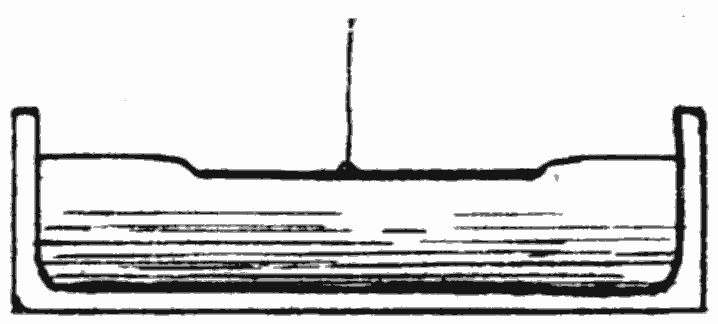

   :small-caps:`Fig.` 1.—Silver sheet floating on water.

We can now understand why a water-beetle is able
to run across the surface of a pond, without wetting
its legs or running any risk of sinking. Each of its
[pg 5]
legs produces a dimple in the surface, but the pressure
on any one leg is not sufficient to break through the
skin. We can imitate this by bringing the point of a
lead pencil gently to the surface of water, when a
dimple is produced, but the skin is not actually penetrated.
On removing the pencil, the dimple immediately
disappears, just as the depression caused by
pushing the finger into a stretched sheet of indiarubber
becomes straight immediately the finger is
removed.

.. _`Elastic Skin of other Liquids—Minimum Thermometer`:

**Elastic Skin of other Liquids—Minimum
Thermometer.**—The possession of an elastic skin
at the surface is not confined to water, but is common
to all liquids. The strength of the skin varies with
different liquids, most of which are inferior to water
in this respect. The surface of petroleum, for example,
is ruptured by a weight which a water surface
can readily sustain. But wherever we have a free
liquid surface, we shall always find this elastic layer
at the boundary, and I will now show, by the aid of
lantern projection, an example in which the presence
of this layer is utilized. On the screen is shown the
stem of a minimum thermometer—that is, a thermometer
intended to indicate the lowest temperature
reached during a given period. The liquid used in
this instrument is alcohol, and you will observe that
the termination of the column is curved (`Fig. 2`_). In
contact with the end of the column is a thin piece of
coloured glass, with rounded ends, which fits loosely
in the stem, and serves as an index. When I warm
the bulb of the thermometer, you notice that the end
of the column moves forward, but the index, round
[pg 6]
which the alcohol can flow freely, does not change its
position. On inclining the stem, the index slides to
the end of the column, but its rounded end does not
penetrate the elastic skin at the surface. I now
pour cold water over the bulb, which causes the
alcohol to contract, and consequently the end of the
column moves towards the bulb. In doing so, it
encounters the opposition of the index, which endeavours
to penetrate the surface; but we see that
the elastic skin, although somewhat flattened, is not
pierced, but is strong enough to push the index in front
of it. And so the index is carried towards the bulb,
and its position indicates the lowest point attained by
the end of the column—that is, the minimum temperature.
Obviously, a thermometer of this kind must
be mounted horizontally, to prevent the index falling
by its own weight.

.. _`Column and index of minimum thermometer`:
.. _`Fig. 2`:

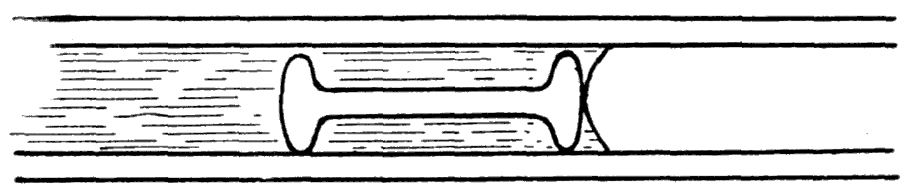

   :small-caps:`Fig.` 2.—Column and index of minimum thermometer.


.. _`Boundary Surface of two Liquids`:

**Boundary Surface of two Liquids.**—So far we
have been considering surfaces bounded by air, or—in
the case of the alcohol thermometer—by vapour.
It is possible, however, for the surface of one
liquid to be bounded by a second liquid, provided the
two do not mix. We may, for example, pour petroleum
on to water, when the top of the water will be in contact
with the floating oil. If now we lower our piece of
[pg 7]
silver foil through the petroleum, and allow it to reach
the surface of the water, we find that the elastic skin
is still capable of sustaining the weight; and thus we see
that the elastic layer is present at the junction of the
two liquids. What is true of water and oil in this
respect also holds good for the boundary or interface
of any two liquids which do not mix. Evidently,
if the two liquids intermingled, there would be no
definite boundary between them; and this would
be the case with water and alcohol, for example.

.. _`Area of Stretched Surface`:

**Area of Stretched Surface.**—We will not at
present discuss the nature of the forces which give rise
to this remarkable property of a liquid surface, but
will consider one of the effects. The tendency, as in
the case of all stretched membranes, will be to reduce
the area of the surface to a minimum. If we take a
disc of stretched indiarubber and place a weight upon
it, we cause a depression which increases the area of the
surface. But on removing the weight, the disc immediately
flattens out, and the surface is restored to
its original smallest dimension. Now, in practice, the
surface of a liquid is frequently prevented from attaining
the smallest possible area, owing to the contrary
action of superior forces; but the tendency is always
manifest, and when the opposing forces are absent or
balanced the surface always possesses the minimum
size. A simple experiment will serve to illustrate this
point. I dip a glass rod into treacle or “golden syrup,”
and withdraw it with a small quantity of the syrup
adhering to the end. I then hold the rod with the
smeared end downwards, and the syrup falls from it
slowly in the form of a long, tapered column. When
[pg 8]
the column has become very thin, however, owing to
the diminished supply of syrup from the rod, we notice
that it breaks across, and the upper portion then
shrinks upwards and remains
attached to the rod in the form
of a small drop (`Fig. 3`_). So
long as the column was thick,
the tendency of the surface
layer to reduce its area to the
smallest dimensions was overpowered
by gravity; but when
the column became thin, and
consequently less in weight, the
elastic force of the outer surface
was strong enough to overcome
gravitation, and the
column was therefore lifted, its
area of surface growing less
and less as it rose, until the
smallest area possible under
the conditions was attained.


.. _`Thread of golden syrup rising and forming a drop`:
.. _`Fig. 3`:

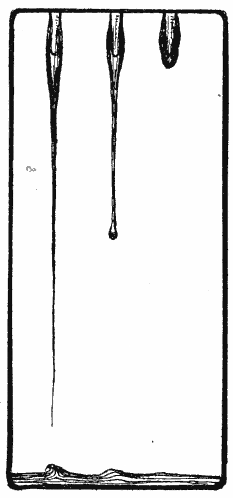

   :small-caps:`Fig.` 3.—Thread of golden
   syrup rising and forming
   a drop.

.. _`Shape of detached Masses of Liquid`:

**Shape of Detached Masses
of Liquid.**—Let us now pay a
little attention to the small
drop of syrup which remains
hanging from the rod. It is in contact with the
glass at the top part only, and the lower portion is
only prevented from falling by the elastic skin around
it, which sustains the weight. We may compare
it to a bladder full of liquid, in which case also
the weight is borne by the containing skin. Now
suppose we could separate the drop of syrup entirely
[pg 9]
from the rod; what shape would it take? We know
that its surface, if not prevented by outside forces
from doing so, would become of minimum area.
Assuming such extraneous forces to be absent or counterbalanced,
what would then be the shape of the drop?
It would be an exact sphere. For a sphere has a less
surface-area in proportion to its volume than any
other shape; and hence a free drop of liquid, if its
outline were determined solely by its elastic skin,
would be spherical. A numerical example will serve
to illustrate this property of a sphere. Supposing we
construct three closed vessels, each to contain 1 cubic
foot, the first being a cube, the second a cylinder of
length equal to its diameter, and the third a sphere.
The areas of the surfaces would then be:—

.. table::
    :class: norules
    :width: 80%

    ========   =============================  ==============================
    Cube       . |nbs2| . |nbs2| . |nbs2| .   6 square feet.
    Cylinder   . |nbs2| . |nbs2| . |nbs2| .   5·86 |nbs2| ,, |nbs3| ,,
    Sphere     . |nbs2| . |nbs2| . |nbs2| .   4·9   |nbs2| ,, |nbs3| ,,
    ========   =============================  ==============================


And whatever shape we make the vessel, it will always
be found that the spherical form possesses the
least surface.

.. _`Drops of different sizes resting on flat plate`:
.. _`Fig. 4`:

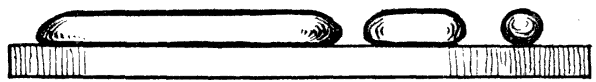

   :small-caps:`Fig.` 4.—Drops of different sizes resting on flat plate.

Now let us examine some of the shapes which drops
actually assume. I take a glass plate covered with
a thin layer of grease, which prevents adhesion of
water to the glass, and form upon it drops of water of
various sizes by the aid of a pipette. You see them projected
on the screen (`Fig. 4`_). The larger drops are
flattened above and below, but possess rounded sides
and resemble a teacake in shape. Those of intermediate
size are more globular, but still show signs of
[pg 10]
flattening; whilst the very small ones, so far as the
eye can judge, are spherical. Evidently, the shape
depends upon the size; and this calls for some explanation.
If we take a balloon of indiarubber filled
with water, and rest it on a table, the weight of the
enclosed water will naturally tend to stretch the balloon
sideways, and so to flatten it. A smaller balloon, made
of rubber of the same strength, will not be stretched
so much, as the weight of the enclosed water would be
less; and if the balloon were very small, but still had
walls of the same strength, the weight of the enclosed
water would be incompetent to produce any visible
distortion. It is evident, however, that so long as it
is under the influence of gravitation, even the smallest
drop cannot be truly spherical, but will be slightly
flattened. The tendency of drops to become spherical,
however, is always present.


.. _`Formation of a sphere of orthotoluidine`:
.. _`Fig. 5`:

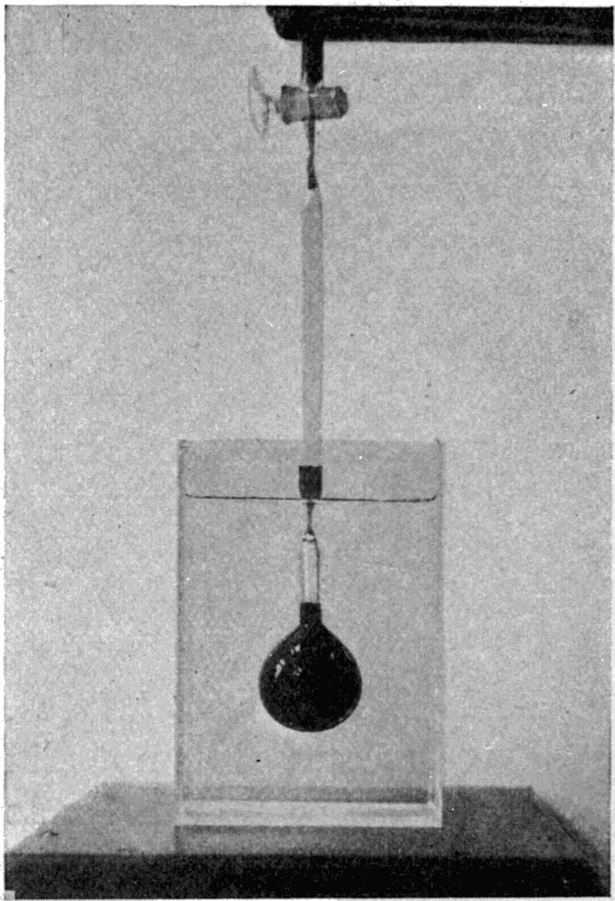

   :small-caps:`Fig.` 5.—Formation of a sphere of orthotoluidine.

.. _`Production of True Spheres of Liquids`:

**Production of True Spheres of Liquids.**—Now
it is quite possible to produce true spheres of liquid,
even of large size, if we cancel the effect of gravity;
and we may obtain a hint as to how this may be accomplished
by considering the case of a soap-bubble, which,
when floating in air, is spherical in shape. Such a
bubble is merely a skin of liquid enclosing air; but
being surrounded by air of the same density, there is
no tendency for the bubble to distort, nor would it
[pg 11]
fall to the ground were it not for the weight of the
extremely thin skin. The downward pull of gravity
on the air inside the bubble is balanced by the buoyancy
of the outside air; and hence the skin, unhampered
by any extraneous force, assumes and retains
the spherical form. And similarly, if we can arrange
to surround a drop of liquid by a medium of the same
density, it will in turn become a sphere. Evidently
the medium used must not mix with the liquid composing
the drop, as it would then be impossible to
establish a boundary surface between the two. Plateau,
many years ago, produced liquid spheres in this
manner. He prepared a mixture of alcohol and water
exactly equal in density to olive oil, and discharged
the oil into the mixture, the buoyancy of which
exactly counteracted the effect of gravity on the oil,
and hence spheres were formed. The preparation of an
alcohol-water mixture of exactly correct density is a
tedious process, and we are now able to dispense with
it and form true spheres in a more convenient way.
There is a liquid known as *orthotoluidine*, which possesses
a beautiful red colour, does not mix with water,
and which has exactly the same density as water when
the temperature of both is 75°\ |nbs| F. or 24°\ |nbs| C. At this
temperature, therefore, if orthotoluidine be run into
water, spheres should be formed; and there is no
reason why we should not be able to make one as large
as a cricket-ball, or even larger. I take a flat-sided
vessel for this experiment, in order that the appearance
of the drop will not be distorted as it would be
in a beaker, and pour into it water at 75°\ |nbs| F. until it
is about two-thirds full. I now take a pipette containing
[pg 12]
a 3 per cent. solution of common salt, and discharge
it at the bottom of the water. Being heavier,
the salt solution will remain below the water, and will
serve as a resting-place for the drop. The orthotoluidine
is contained in a vessel provided with a tap
and wide stem, which is now inserted in the water so
that the end of the stem is about 1 inch above the top
of the salty layer. I now open the tap so as to allow
the orthotoluidine to flow out gradually; and we then
see the ball of liquid growing at the end of the stem
[pg 13]
(`Fig. 5`_). By using a graduated vessel, we can read
off the quantity of orthotoluidine which runs out, and
thus measure the volume of the sphere formed. When
the lower part reaches the layer of salt solution, we
raise the delivery tube gently, and repeat this as
needed during the growth of the sphere. We have now
run out 100 cubic centimetres, or about one-sixth of a
pint, and our sphere consequently has a diameter of 5¾
centimetres, or 2¼ inches. To set it free in the water
we lift the delivery tube rapidly—and there is the
[pg 14]
sphere floating in the water (`Fig. 6`_). We could have
made it as much larger as we pleased, but the present
sphere will serve all our requirements.

.. _`Detached sphere floating under water`:
.. _`Fig. 6`:

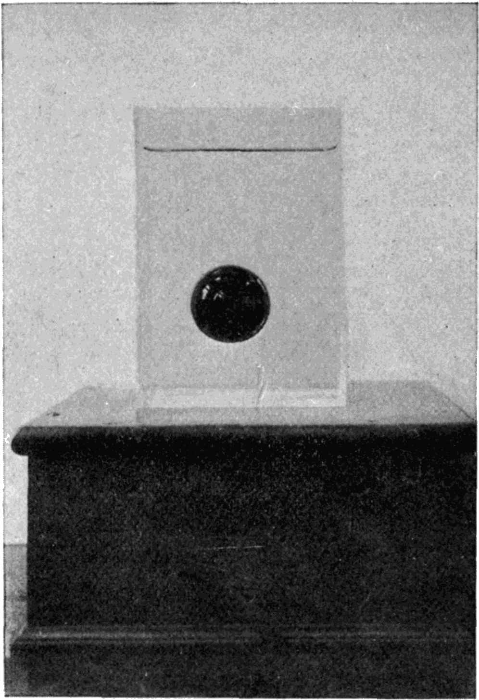

   :small-caps:`Fig.` 6.—The detached sphere floating under water.


.. _`The centrifugoscope`:
.. _`Fig. 7`:

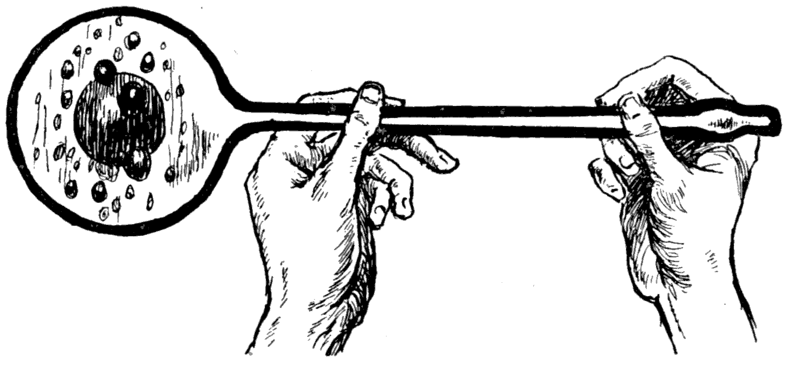

   :small-caps:`Fig.` 7.—The Centrifugoscope.


**The Centrifugoscope.**—I have here a toy, which
we may suitably call the centrifugoscope, which shows
in a simple way the formation of spheres of liquid in a
medium of practically equal density. It consists of a
large glass bulb attached to a stem, about three-quarters
full of water, the remaining quarter being
occupied by orthotoluidine. This liquid, being slightly
denser than water at the temperature of the room,
rests on the bottom of the bulb. When I hold the
stem horizontally, and rotate it—suddenly at first,
and steadily afterwards—a number of fragments are
detached from the orthotoluidine, which immediately
become spherical, and rotate near the outer side of the
bulb. The main mass of the red liquid rises to the
centre of the bulb, and rotates on its axis (`Fig. 7`_),
and we thus get an imitation of the solar system, with
the planets of various sizes revolving round the central
[pg 15]
mass; and even the asteroids are represented by the
numerous tiny spheres which are always torn off from
the main body of liquid along with the larger ones.
When the rotation ceases, the detached spheres sink,
and after a short time join the parent mass of orthotoluidine.
We can therefore take this simple apparatus
at any time, and use it to show that a mass of liquid,
possessing a free surface all round, and unaffected by
gravity, automatically becomes a sphere. After all,
this is only what we should expect of an elastic skin
filled with a free-flowing medium.

.. _`Effect of Temperature on Sphere of Orthotoluidine`:

**Effect of Temperature on Sphere of Orthotoluidine.**—I
will now return to the large sphere
formed under water in the flat-sided vessel, and direct
your attention to an experiment which teaches an
important lesson. By placing a little ice on the top of
the water, we are enabled to cool the contents of the
vessel, and we soon notice that the red-coloured sphere
becomes flattened on the top and below, and sinks a
short distance into the saline layer. Evidently the
cooling action, which has affected both liquids, has
caused the orthotoluidine to become denser than water.
I now surround the vessel with warm water, and allow
the contents gradually to attain a temperature higher
than 75°\ |nbs| F. You observe that the flattened drop
changes in shape until it is again spherical; and as the
heating is continued elongates in a vertical direction,
and then rises to the surface, being now less dense than
water. So sensitive are these temperature effects
that a difference of 1 degree on either side of 75°\ |nbs| F.
causes a perceptible departure from the spherical shape
in the case of a large drop. It therefore follows that
[pg 16]
orthotoluidine may be either heavier or lighter than
water, according to temperature, and this fact admits
of a simple explanation. Orthotoluidine expands
more than water on heating, and contracts more on
cooling. The effect of expansion is to decrease the
density, and of contraction to increase it; hence the
reason why warm air rises through cold air, and vice
versa. Now if orthotoluidine and water, which are
equal in density at 75°\ |nbs| F., expanded or contracted
equally on heating above or cooling below this temperature,
their densities would always be identical.
But inasmuch as orthotoluidine increases in volume
to a greater extent than water on heating, and shrinks
more on cooling, it becomes lighter than water when
both are hotter than 75°\ |nbs| F., and heavier when both are
colder. We call the temperature when both are equal
in density the *equi-density temperature*. Here are some
figures which show how the densities of these two liquids
diverge from a common value on heating or cooling,
and which establish the conclusions we have drawn:—

.. table::
   :class: norules
   :width: 100%
   :align: center
   :aligns: right center center center

   +-----------------+----------+----------------------------+
   |    Temperature. |          |           Density.         |
   +-----------------+----------+-----------+----------------+
   |          Deg. F.| Deg. C.  |  Water.   | Orthotoluidine.|
   +=================+==========+===========+================+
   |             50  |    10    |   0·9997  |    1·009       |
   +-----------------+----------+-----------+----------------+
   |             59  |    15    |   0·9991  |    1·005       |
   +-----------------+----------+-----------+----------------+
   |             68  |    20    |   0·9982  |    1·001       |
   +-----------------+----------+-----------+----------------+
   | Equal:|nbs3| 75 |    24    |   0·9973  |    0·997       |
   +-----------------+----------+-----------+----------------+
   |             86  |    30    |   0·9957  |    0·992       |
   +-----------------+----------+-----------+----------------+
   |             95  |    35    |   0·9940  |    0·988       |
   +-----------------+----------+-----------+----------------+
   |            104  |    40    |   0·9923  |    0·983       |
   +-----------------+----------+-----------+----------------+

[pg 17]

.. _`Aniline drops falling through cold water and
   ascending through hot water`:
.. _`Fig. 8`:
.. _`8`:

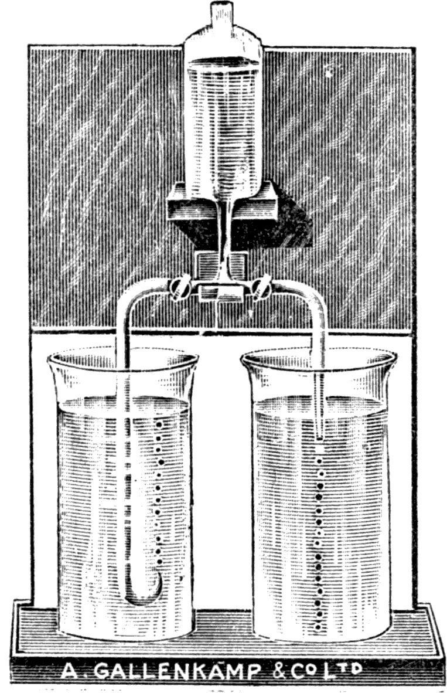

   :small-caps:`Fig.` 8.—Aniline drops falling through cold water and
   ascending through hot water.

.. _`Other Examples of Equi-Density`:

**Other Examples of Equi-Density.**—There are
many other liquids which, like orthotoluidine, may be
heavier or lighter than water, according to temperature,
and I now wish to bring to your notice the remarkable
liquid *aniline*, which falls under this head.
Aniline is an oily liquid, which, unless specially purified,
has a deep red colour. It forms the basis of the
beautiful and varied colouring materials known as the
aniline dyes, which we owe to the skill of the chemist.
The equi-density temperature of water and aniline is
147°\ |nbs| F. or 64°\ |nbs| C.; that is, aniline will sink in water
if both be colder than 147°\ |nbs| F., and rise to the surface
if this temperature be exceeded. We may illustrate
this fact by a simple but striking experiment. Here
[pg 18]
are two tall beakers side by side, and above them a cistern
containing aniline (`Fig. 8`_). The stem of the cistern
communicates with the two branches of a horizontal
tube, the termination of one branch being near the
top of one of the beakers, whilst the other branch is
prolonged to the bottom of the second beaker, and is
curved upwards at the end. Both branches are provided
with taps to regulate the flow of liquid, and to
commence with are full of aniline. Cold water is
poured into the beaker containing the shorter branch
until the end is submerged; and water nearly boiling
is placed in the second beaker to an equal height. I
now open the taps, so that the aniline may flow gradually
into each beaker; and you notice that the drops
of aniline sink through the cold water and rise through
the hot. We have thus the same liquid descending
and ascending simultaneously in water, the only
difference being that the water is cold on the one side
and hot on the other. Prolonging the delivery-tube
to the bottom of the beaker containing the hot water
enables the rising drops to be observed throughout
the length of the column of water; and in addition
enables the cold aniline from the cistern to be warmed
up on its way to the outlet, so that by the time it
escapes its temperature is practically the same as that
of the water. If this temperature exceed 147°\ |nbs| F., the
drops will rise. We might, in this experiment, have
used orthotoluidine instead of aniline; or, indeed, any
other liquid equal in density to water at some temperature
intermediate between those of the hot and cold
water—always provided that the liquid chosen did not
mix with water. Amongst such other liquids may be
[pg 19]
mentioned *anisol*; *butyl benzoate*; and *aceto-acctic
ether*; but none of these possess the fine colour of
aniline or its chemical relative orthotoluidine, and in
addition are more costly liquids. Besides these are a
number of other liquids rarer still, practically only
known to the chemist, which behave in the same way.
These liquids are all carbon compounds, and more or
less oily in character. There is a simple rule which
may be used to predict whether any organic liquid
will be both lighter and heavier than water, according
to temperature. Here it is: If the density of the
liquid at 32°\ |nbs| F. or 0°\ |nbs| C. be not greater than 1·12, the
liquid will become less dense than water below 212°\ |nbs| F.
or 100°\ |nbs| C., at which temperature water boils. This rule
is derived from a knowledge of the extent to which the
expansion of organic liquids in general exceeds that
of water. I have considered it necessary to enter at
some length into this subject of equi-density, as much
that will follow involves a knowledge of this physical
relation between liquids.

.. _`Aniline Films or Skins`:

**Aniline Films or Skins.**—We have previously
concluded, largely from circumstantial evidence, that a
liquid drop is encased in a skin or what is equivalent
to a skin, and I propose now to show by experiments
with aniline how we can construct a drop, commencing
with a skin of liquid. Here is some aniline in a vessel,
covered by water. I lower into the aniline a circular
frame of wire, which I then raise slowly into the overlying
water; and you observe that a film of aniline
remains stretched across the frame. By lifting the
frame up and down in the water the skin is stretched,
forming a drop which is constricted near the frame
[pg 20]
(`Fig. 9`_). On lifting the wire more suddenly, the skin
of aniline closes in completely at the narrow part, and
a sphere of water, encased in an aniline skin, then falls
through the water in the beaker, and comes to rest on
the aniline below—into which, however, it soon merges.
You were previously asked to regard a drop of liquid
as being similar to a filled soap-bubble; and this
experiment realizes the terms of the definition. And it
requires only a little imagination to picture a drop
surrounded by its own skin instead of that of another
liquid. It is easy to make one of these enclosed
water-drops by imitating the blowing of a soap-bubble—using,
however, water instead of air. In order to
do this I take a piece of glass tubing, open at both ends,
[pg 21]
and pass it down the vessel, until it reaches the aniline.
Water, in the meantime, has entered the tube, to the
same height as that at which it stands in the vessel.
On raising the tube gently, a skin of aniline adheres
to the end; and as we raise it still further, the water
in the tube, sinking so as to remain at the level in the
vessel, expands the skin into a sphere (`Fig. 9`_)—the
equivalent of a filled soap-bubble. On withdrawing
the tube gradually, the composite sphere is left hanging
from the surface of the water.

.. _`Aniline skins enveloping water`:
.. _`Fig. 9`:

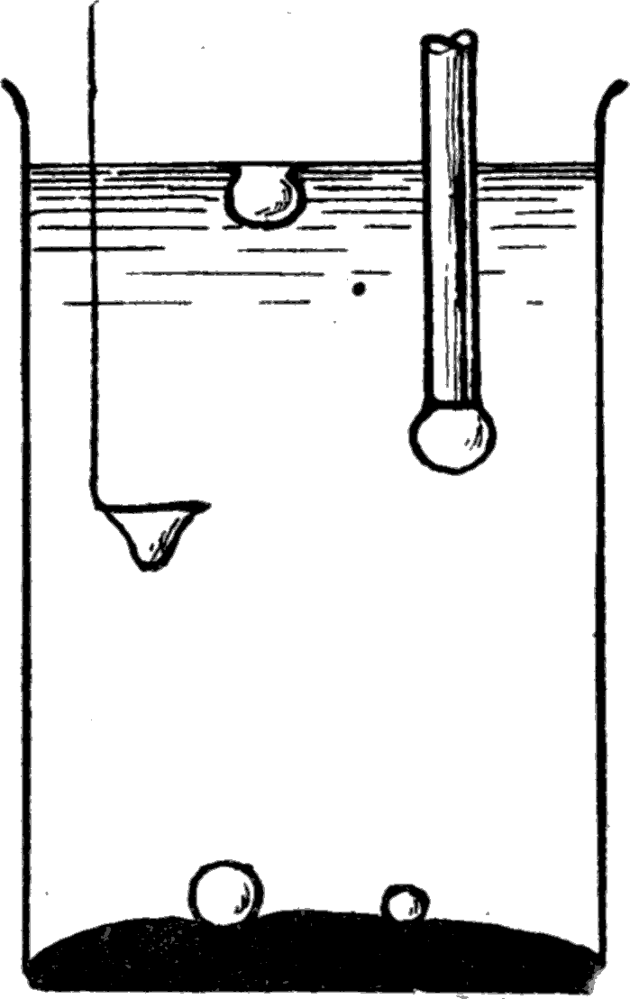

   :small-caps:`Fig.` 9.—Aniline skins enveloping water.

.. |1/6| replace:: |nbs| :superscript:`1`/:subscript:`6`
.. vulgar fraction 1/6 is unicode U+2159 but not supported by unitame 

.. |8/100| replace:: :superscript:`8`/:subscript:`100`

.. _`Surface Tension`:

**Surface Tension.**—Before proceeding further, it
will be advisable to introduce and explain the term
“surface tension.” We frequently use it, without
attaching to it any numerical value, to express the
fact that the free surface of a liquid is subjected to
stretching forces, or is in a state of tension; and thus
we say that certain phenomena are “due to surface
tension.” But the physicist does not content himself
with merely observing occurrences; he tries also to
measure, in definite units, the quantities involved in
the phenomena. And hence surface tension is defined
as the force tending to pull apart the two portions of
the surface on either side of a line 1 centimetre in length.
That is, we imagine a line 1 centimetre long on the
surface of the liquid, dividing the surface into two
portions on opposite sides of the line, and we call the
force tending to pull these two portions away from
each other the surface tension. Experiments show
that this force, in the case of cold water, is equal to
about 75 dynes, or nearly |8/100| of a gramme. If we choose
a line 1 inch long on the surface of water, the surface
tension is represented by about 3\ |1/6| grains. It is always
[pg 22]
necessary to specify the length when assigning a value
to the surface tension; and unless otherwise stated
a length of 1 centimetre is implied. The values for
different liquids vary considerably; and it is also
necessary to note that the figure for a given liquid
depends upon the nature of the medium by which it
is bounded—whether, for example, the surface is in
contact with air or another liquid. The following
table gives the values for several liquids when the
surfaces are in contact with air:—

.. table::
   :class: norules
   :width: 100%
   :align: center
   :widths: 1 1
   :aligns: center center

   +-----------------+--------------------------------------+
   |       Liquid.   |  Tension at 15°\ |nbs| C.            |
   |                 |  (59°\ |nbs| F.), dynes per cm.      |
   +=================+======================================+
   | Water           |                 75                   |
   +-----------------+--------------------------------------+
   | Aniline         |                 43                   |
   +-----------------+--------------------------------------+
   | Olive Oil       |                 32                   |
   +-----------------+--------------------------------------+
   | Chloroform      |                 27                   |
   +-----------------+--------------------------------------+
   | Alcohol         |                 25                   |
   +-----------------+--------------------------------------+


When one liquid is bounded by another, the *interfacial*
tension, as it is called, is generally less than when in
contact with air. Thus the value for water and olive
oil is about 21 dynes per centimetre at 15°\ |nbs| C.

We are now in a position to speak of surface tension
*quantitatively*, and shall frequently find it necessary
to do so in order to explain matters which will come
under our notice later.

.. _`The “diving” drop. Three stages`:
.. _`Fig. 10`:
.. _`Fig. 11`:
.. _`Fig. 12`:
.. _`Figs. 11 and 12`:


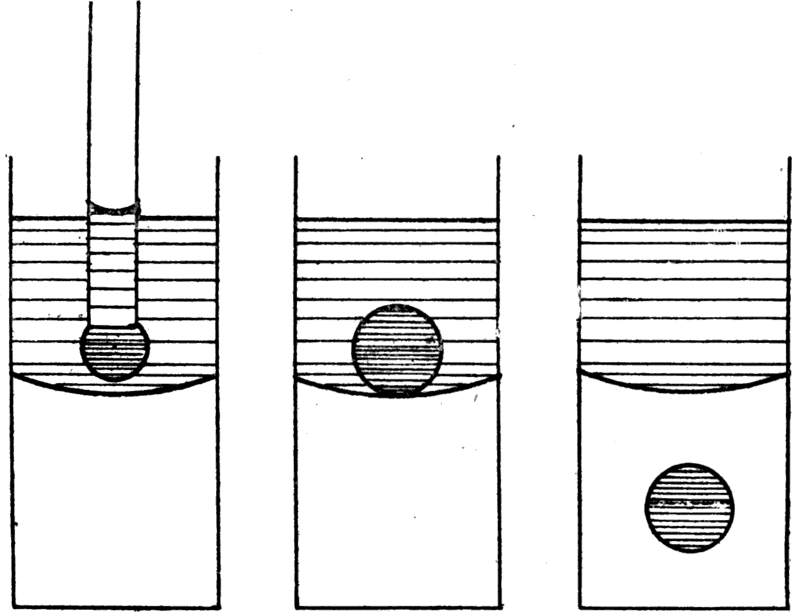

   :small-caps:`Figs.` 10, 11 and 12.—The Diving Drop. Three stages.

.. _`The “Diving” Drop`:

**The “Diving” Drop.**—In order to illustrate the
tension at the boundary surface of two liquids, I now
show an experiment in which a drop is forcibly projected
downwards by the operation of this tension. 
I pour some water into a narrow glass vessel, and float
[pg 23]
upon it a liquid called *dimethyl-aniline*, so as to form
a layer about 1 inch in depth. A glass tube, open at
both ends, is now passed down the floating liquid into
the water, and then raised gradually, with the result
that a skin of water adheres to the end, and is inflated
by the upper liquid, forming a sphere on the end of
the tube (`Fig. 10`_). On withdrawing the tube from
the upper surface, the sphere is detached and falls to
the boundary surface, where it rests for a few seconds,
and is then suddenly shot downwards into the water
(`Figs. 11 and 12`_). It then rises to the interface;
breaks through, and mingles with the floating
liquid, thereby losing its identity. Why should the
drop, which is less dense than water, dive below in
[pg 24]
this manner? The explanation is that the drop
(which consists of a skin of water filled with dimethyl-aniline),
after resting for a time on the joining surface,
loses the under part of its skin, which merges into the
water below. The shape of the boundary of the two
liquids is thereby altered, the sides now being continuous
with the skin forming the upper part of the
drop. This is an unstable shape; and accordingly
the boundary surface flattens to its normal condition,
and with such force as to cause the drop beneath it
to dive into the water, although the liquid is lighter
than water and tends to float. The result is the same
as that which would occur if a marble were pressed on
to a stretched disc of rubber, and then released, when
it would be projected upwards owing to the straightening
of the disc. I now repeat the experiment, using
paraffin oil instead of dimethyl-aniline; but in this case
the drop is only projected to a small depth, and the
effect is not so marked. The experiment furnishes
conclusive evidence of the existence of the interfacial
tension.

.. _`Formation of Falling Drops of Liquid`:

**Formation of Falling Drops of Liquid.**—We
will now direct our attention to one of the most beautiful
of natural phenomena—the growth and partition
of a drop of liquid. Let us observe, by the aid of the
lantern, this process in the case of water, falling in
drops from the end of a glass tube. The flow of water
is controlled by a tap, and you observe that the drop
on the end gradually grows in size, then becomes
narrower near the end of the tube, and breaks across
at this narrow part, the separated drop falling to the
ground. Another drop then grows and breaks away;
[pg 25]
but the process is so rapid that the details cannot be
observed. None of you saw, for example, that each
large drop after severance was followed by a small
droplet, formed from the narrowed portion from which
the main drop parted. But the small, secondary drop
is always present, and is called, in honour of its discoverer,
Plateau's spherule. Nor did any of you
observe that the large drop, immediately after separation,
became flattened at the top, nor were you able
to notice the changing shape of the narrow portion.
To show all these things it will be necessary to modify
the experimental conditions.

Mr. H. G. Wells, in one of his short stories, describes
the wonderful effects of a dose of a peculiarly potent
drug, called by him the “Accelerator.” While its
influence lasted, all the perceptions were speeded up
to a remarkable degree, so that occurrences which
normally appeared to be rapid seemed absurdly slow.
A cyclist, for example, although travelling at his best
pace, scarcely appeared to be making any movement;
and a falling body looked as if it were stationary.
Now if we could come into possession of some of this
marvellous compound, and take the prescribed quantity,
we should then be able to examine all that happens
when a drop forms and falls at our leisure. But it is
not necessary to resort to such means as this to render
the process visible to the eye. We could, for example,
take a number of photographs succeeding each other
by very minute intervals of time—a kind of moving
picture—from which the details might be gleaned by
examining the individual photographs. This procedure,
however, would be troublesome; and evidently
[pg 26]
the simplest plan, if it could be accomplished, would
be to draw out the time taken by a drop in forming
and falling. And our previous experiments indicate
how this may be done, as we shall see when we have
considered the forces at work on the escaping liquid.

A liquid issuing from a tube is pulled downwards
by the force of gravitation, and therefore is always
tending to fall. At first, when the drop is small, the
action of gravity is overcome by the surface tension
of the liquid; but as the drop grows in size and increases
in weight, a point arrives at which the surface tension
is overpowered. Then commences the formation
of a neck, which grows narrower under the stretching
force exerted by the weight of the drop, until rupture
takes place. Now if we wish to make the process
more gradual, it will be necessary to reduce the effect
of gravity, as we cannot increase the surface tension.
We have already seen how this may be done in connexion
with liquid spheres—indeed, we were able to
cancel the influence of gravity entirely, by surrounding
the working liquid by a second liquid of exactly equal
density. We require now, however, to allow the
downward pull of the drop ultimately to overcome
the surface tension, and we must therefore form the
drop in a less dense liquid. If this surrounding liquid
be only slightly less dense, we should be able to produce
a very large drop; and if we make its growth slow we
may observe the whole process of formation and
separation with the unaided eye.

.. _`Apparatus for forming ascending or descending
  drops of liquids`:
.. _`Fig. 13`:
.. _`13`:

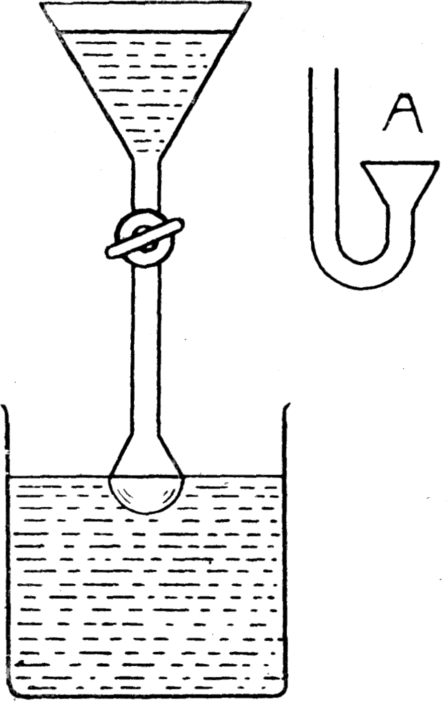

   :small-caps:`Fig.` 13.—Apparatus for forming ascending or descending
   drops of liquids.


Now it so happens that we have to hand two liquids
which, without any preparation, fulfil our requirements.
Orthotoluidine, at temperatures below 75°\ |nbs| F.
[pg 27]
or 24°\ |nbs| C., is denser than water of equal temperature.
At 75°\ |nbs| F. their densities are identical; and as the
ordinary temperature of a room lies between 60° and
70°\ |nbs| F., water, under the prevailing conditions, will be
slightly the less dense of the two, and will therefore
form a suitable medium in which to form a large drop
of orthotoluidine. I therefore run this red-coloured
liquid into water from a funnel controlled by a tap
(`Fig. 13`_), and in order to make a large drop the end
of the stem is widened to a diameter of 1½ inches. It
is best, when starting, to place the end of the stem
[pg 28]
in contact with the surface of the water, as the first
quantity of orthotoluidine which runs down then
spreads over the surface and attaches itself to the rim
of the widened end of the stem. The tap is regulated
so that the liquid flows out slowly, and we may now
watch the formation of the drop. At first it is nearly
hemispherical in shape; gradually, as you see, it
becomes more elongated; now the part near the top
commences to narrow, forming a neck, which, under
the growing weight of the lower portion, is stretched
until it breaks, setting the large drop free (`Figs. 14
to 18`_). And then follows the droplet; very small
by comparison with the big drop, but plainly visible
(`Figs. 19 and 20`_). The graceful outline of the drop
at all stages of the formation must appeal to all who
possess an eye for beauty in form; free-flowing curves
that no artist could surpass, changing continuously
until the process is complete.

Slow as was the formation of this drop, it was still too
rapid to enable you to trace the origin of the droplet.
It came, as it always does come, from the drawn-out
neck. When the large drop is severed, the mass of
liquid clinging to the delivery-tube shrinks upwards,
as the downward pull upon it is now relieved. The
result of this shrinkage—which, as usual, reduces the
area of surface to the minimum possible—is to cut off
the elongated neck, at its upper part, thus leaving free
a spindle-shaped column of liquid. This column
immediately contracts, owing to its surface tension, until
its surface is a minimum—that is, it becomes practically
a sphere; and this constitutes the droplet. In a later
experiment, in which the formation is slower still, and
[pg 29]
the liquid more viscous, the origin of the droplet will
be plainly seen, and the correctness of the description
verified. The recoil due to the liberation of the stretching
force after rupture of the neck was visible on the
top of the large drop, and also on the bottom of the
portion of liquid which remained attached to the tube,
both of which were momentarily flattened (`Figs. 19 and
20`_) before assuming their final rounded shape. This
is exactly what we should expect to happen if a filled
skin of indiarubber were stretched until it gave way
at the narrowest part.

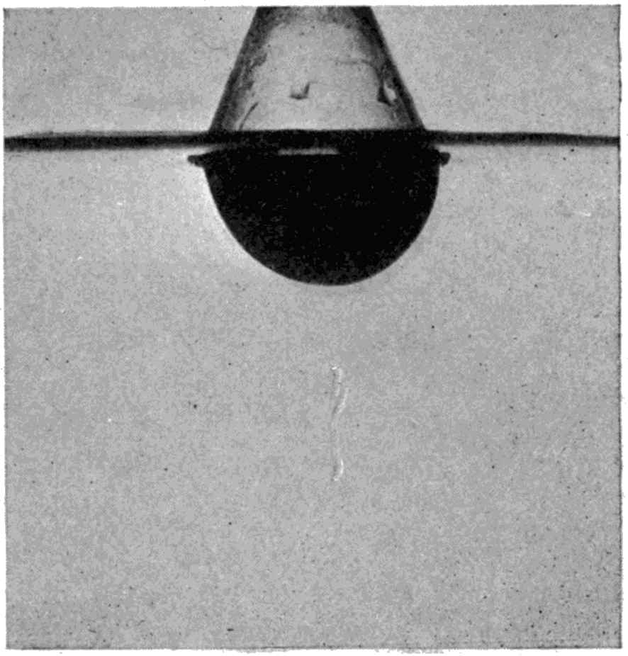

   :small-caps:`Fig.` 14.

As a variation on the two liquids just used, I now
take the yellow liquid *nitrobenzene*, and run it into
nitric acid (or other suitable medium) of specific gravity
1·2, and you observe the same sequence of events as
in the previous experiment, even to the details. Very
rapid photography shows that the breaking away of a
drop of water from the end of a tube in air is in all
[pg!30]
[pg 31]
respects identical with what we have just seen on a large
scale.


.. _`Formation of a drop of orthotoluidine, showing
  the droplet. Seven stages`:
.. _`Figs. 14 to 20`:
.. _`Figs. 14 to 18`:

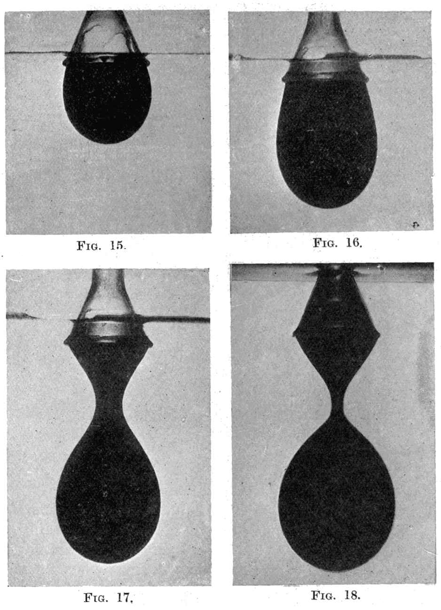

   :small-caps:`Figs.` 14 to 20.—Formation of a drop of orthotoluidine, 
   showing the droplet. Seven stages.

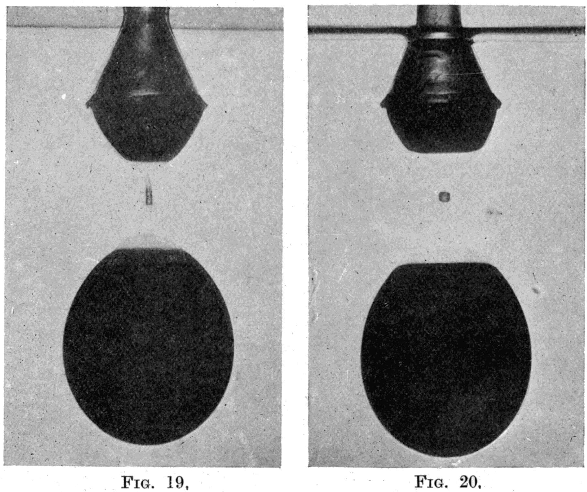

.. _`Figs. 19 and 20`:

.. _`Ascending or Inverted Drops`:

**Ascending or Inverted Drops.**—If we discharge
orthotoluidine into water when both are hotter than
75°\ |nbs| F., the former liquid will rise, as its density is now
less than that of water. If, therefore, I take a funnel
with the stem bent into a parallel branch, so as to
discharge upwards (A, `Fig. 13`_) and raise the temperature
of both liquids above 75°\ |nbs| F., we see that the drop
gradually grows towards the top of the water, finally
breaking away and giving rise to the droplet. Everything,
[pg 32]
in fact, was the same as in the case of a falling
drop, except that the direction was reversed. A
slight rise in temperature has thus turned the whole
process topsy-turvy, but the action is really the same
in both cases. When, on heating, the water acquired
the greater density, its buoyancy overcame the pull of
gravitation on the orthotoluidine, and accordingly the
drop was pushed upwards, the result being the same
as when it was pulled downwards. An inverted drop
may always be obtained by discharging a light liquid
into a heavier one, e.g. olive oil into water, or water
into any of the liquids mentioned on p. 19, below
the equi-density temperature.

[pg 33]


LECTURE II
==========

.. _`Automatic Aniline Drops`:

**Automatic Aniline Drops.**—In the foregoing
experiments the drop was enlarged until it broke away
by feeding it with liquid; but it is possible to arrange
that the formation shall be quite automatic. The
experiment, as we shall see, is extremely simple, and
yet it contains an element of surprise. Into a beaker
containing water nearly boiling I pour a considerable
quantity of aniline, which at first breaks up into a
large number of drops. After a short time, however,
all the aniline floats to the surface, having been warmed
by contact with the water to a temperature higher
than that of equi-density (147°\ |nbs| F., or 64°\ |nbs| C.)—which is
exactly what we should expect to happen. There it
remains for a brief period in the form of a large mass
with the lower portion curved in outline. Soon, however,
we observe the centre of the mass sinking in the
water, and taking on the now familiar outline of a
falling drop. Gradually, it narrows at the neck and
breaks away; but as aniline is a viscous liquid, the
neck in this case is long and therefore easily seen. The
large drop breaks away and falls to the bottom of the
beaker, its upper surface rising and falling for some
time owing to the recoil of its skin after separation,
[pg 34]
finally becoming permanently convex. Immediately
after the large drop has parted, the upper mass shrinks
upwards, spreading out further on the surface of the
water, with the result that the long neck is severed at
the top, its own weight assisting the breakage. Now
follows the resolution of the detached neck into two or
more spheres, usually a large and a small (`Fig. 22`_).
And now, to those who view the experiment for the
first time, comes the surprise. The large drop, which
[pg 35]
was more or less flattened when it came to rest at the
bottom of the beaker, becomes more and more rounded,
and finally spherical. Then, unaided, it rises to the
top and mingles itself with the aniline which remained
on the surface. After a brief interval a second drop
falls, imitating the performance of the first one; and,
[pg 36]
like its predecessor, rises to the surface, after remaining
for a short time at the bottom of the vessel. And so
long as we keep the temperature a few degrees above
that of equi-density, the process of partition and reunion
goes on indefinitely. The action is automatic
and continuous, and the large size of the drop and of
the neck, and the slowness of the procedure, enables us
to follow with ease every stage in the formation of a
parting drop.

.. _`Automatically formed aniline drops, showing
  the formation of droplets from the neck`:
.. _`Figs. 21, 22`:


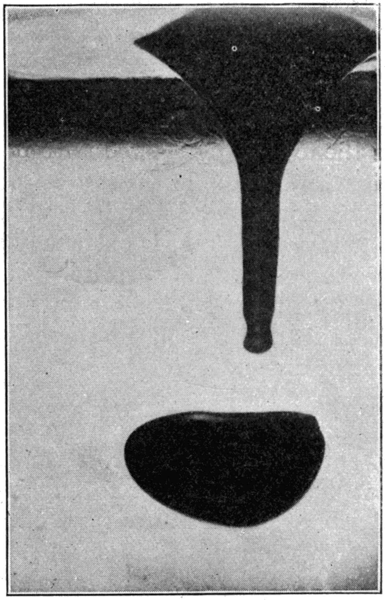

   :small-caps:`Fig.` 21.

.. _`Fig. 22`:

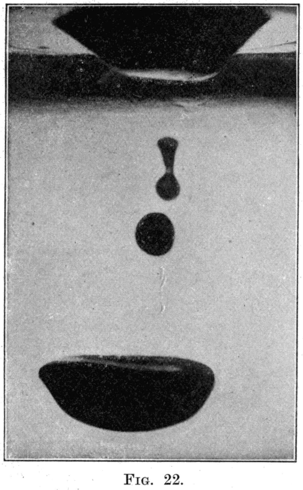

   :small-caps:`Figs.` 21 and 22.—Automatically formed aniline drops, showing
   the formation of droplets from the neck.


And now as to the explanation of this curious
performance. When the aniline reaches the surface,
and spreads out, it cools by contact with the air more
rapidly than the water below. As it cools, its density
increases, and soon becomes greater than that of the
water, in which it then attempts to sink. The forces
of surface tension prevent the whole of the aniline
from falling—the water surface can sustain a certain
weight of the liquid—but the surplus weight cannot be
held, and therefore breaks away. But when the
detached drop reaches the bottom of the vessel, it is
warmed up again; and when its temperature rises
above that of equi-density it floats up to the top. And
so the cycle of operations becomes continuous, owing
to cooling taking place at the top and heating at the
bottom.

Perpetual motion, you might suggest. Nothing of
the kind. Perpetual motion means the continuous
performance of work without any supply of energy;
it does not mean merely continuous movement. A
steam-engine works so long as it is provided with
steam, and an electric motor so long as it is fed with
electricity; but both stop when the supply of energy
[pg 37]
is withdrawn. So with our aniline drop, which derives
its energy from the heat of the water, and which comes
to rest immediately the temperature falls below 147°\ |nbs| F.
or 64°\ |nbs| C. But in order that the process of separation
and reunion may continue, the cooling at the top is
quite as necessary as the heating at the bottom. Our
aniline drop is in essence a heat-engine—although it
does no external work—and like all heat-engines
possesses a source from which heat is derived, and a sink
into which heat at a lower temperature is rejected.
We might, with certain stipulations, work out an
indicator diagram for our liquid engine, but that
would be straying too far from our present subject.

.. _`Automatic Drops of other Liquids`:

**Automatic Drops of other Liquids.**—Liquids
which possess a low equi-density temperature with
water do not form automatic drops like aniline, as the
rate of cooling at the surface is too slow, and hence
the floating mass of liquid does not attain a density
in excess of that of the water beneath. Aceto-acetic
ether, however, behaves like aniline, if the temperature
of the water be maintained at about 170°\ |nbs| F. (77°\ |nbs| C.),
but as this liquid is fairly soluble in hot water further
quantities must be added during the progress of the
experiment. Results equal to those obtained with
aniline, however, may be secured by using nitrobenzene
in nitric acid of specific gravity 1·2 at 59°\ |nbs| F.
(15°\ |nbs| C.), the acid being heated to 185°\ |nbs| F. (85°\ |nbs| C.); and
here you see the yellow drop performing its alternate
ascents and descents exactly as in the case of aniline
and water. Other examples might be given; but we
may take it as a general rule that when the equi-density
temperature of the liquid and medium is above
[pg 38]
125°\ |nbs| F. (52°\ |nbs| C.), the phenomenon of the automatic
drop may usually be observed when the temperature
is raised by 30°\ |nbs| F. (17°\ |nbs| C.), above this point.

.. _`Liquid Jets`:

**Liquid Jets.**—So far we have been observing the
formation of single drops, growing slowly at the end
of a tube, or breaking away from a large mass of the
floating liquid. If, however, we accelerate the speed
at which the liquid escapes, the drop has no time to
form at the outlet, and a jet is then formed. We are
all familiar with a jet of water escaping from a tap;
it consists of an unbroken column of the liquid up
to a certain distance, depending upon the pressure,
but the lower part is broken up into a large number
of drops, which break away from the column at a
definite distance from the tap. There are many
remarkable features about jets which I do not intend
to discuss here, as it is only intended to consider the
manner in which the drops at the end are formed. To
observe this procedure, it is necessary again to resort
to our method of slowing down the rate of formation,
by allowing the liquid to flow into a medium only
slightly inferior in density. For this purpose, orthotoluidine
falling into water at the ordinary room temperature
is eminently satisfactory; and we see on the
screen the projection of a pipe, with its end under
water, placed so that a jet of orthotoluidine may be
discharged vertically downwards from a stoppered
funnel. I open the tap slightly at first, and we then
merely form a single drop at the end. Now it is opened
more widely, and you observe that the drop breaks
away some distance below the outlet, being rapidly
succeeded by another and another (`Fig. 23`_). On still
[pg 39]
further opening the tap the drops form at a still greater
distance from the end of the pipe, and succeed each
other more rapidly, so that quite a number appear in
view at any given moment (`Figs. 24 and 25`_). Notice
how the drop is distorted by breaking away from the
[pg 40]
stream of liquid, and how it gradually recovers its
spherical shape during its fall through the water.
Finally, I increase the discharge to such an extent that
the formation of the terminal drops is so rapid as to
be no longer visible to the eye, but appears like the
turmoil observed at the end of a jet of water escaping
into air.

.. _`Jets of orthotoluidine discharged under water`:
.. _`Fig. 23`:
.. _`Figs. 24 and 25`:
.. _`Figs. 23, 24, 25`:

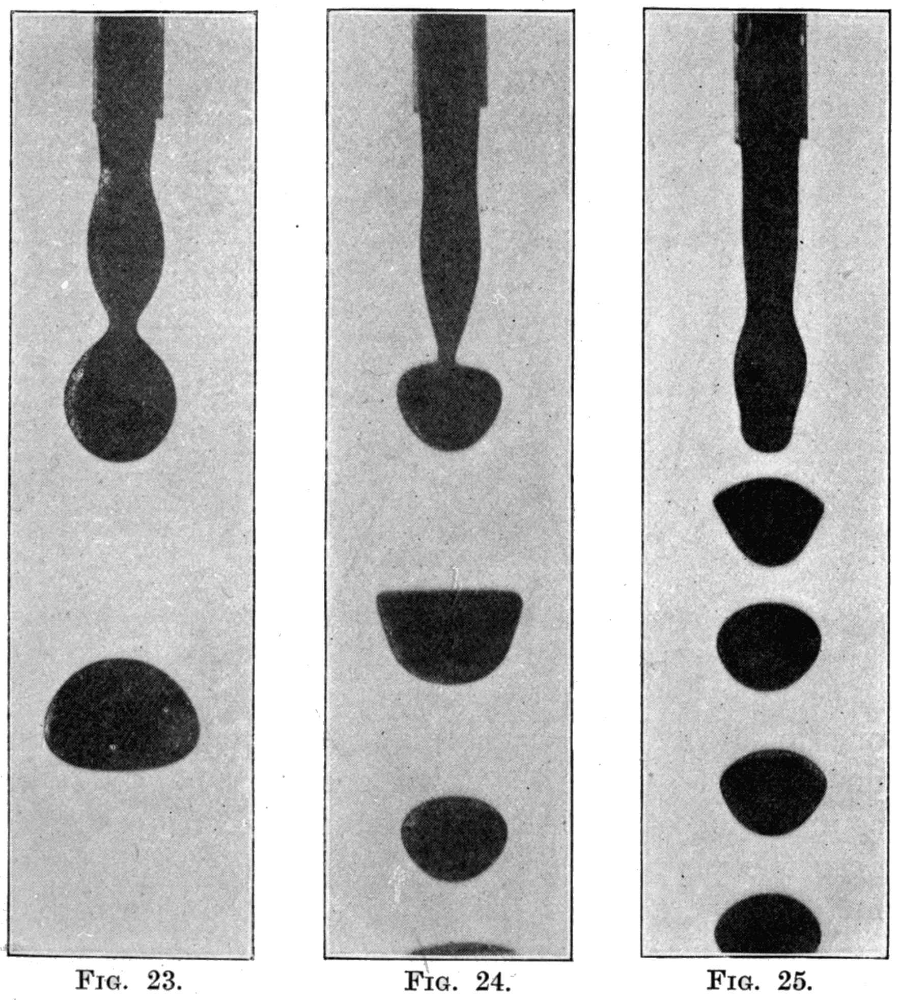

   :small-caps:`Figs.` 23, 24, 25.—Jets of Orthotoluidine, discharged under
   water.

.. _`Water stretched between a tube and a plate`:
.. _`Fig. 26`:

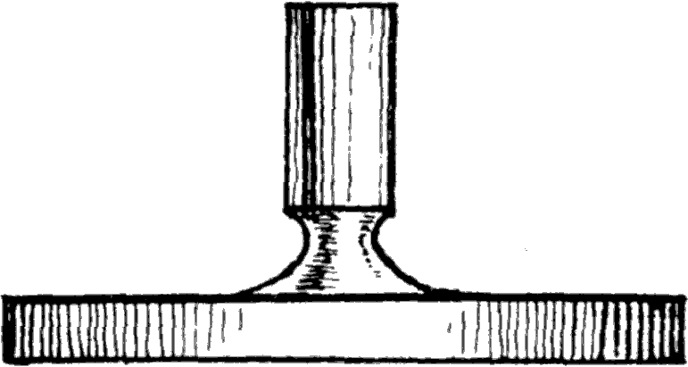

   :small-caps:`Fig.` 26.—Water stretched between a tube and a plate.

.. _`Liquid Columns`:

**Liquid Columns.**—A simple experiment will suffice
to illustrate what is meant by a liquid column. Here
is a drop of water hanging from the end of a glass tube.
I place it in the lantern and obtain a magnified image
on the screen, and then bring up a flat plate of glass
until it just touches the suspended drop. As soon as
contact is established, the water spreads outwards
over the plate, causing the drop to contract in diameter
at or near its middle part, so that its outline
resembles that of a capstan (`Fig. 26`_). The end of the
glass tube is now connected to the plate by a column
of water of curved outline, which is quite stable if
undisturbed. If, however, I gradually raise the tube,
or lower the plate, the narrow part of the column
becomes still narrower, and finally breaks across. In
the same way we may produce columns of other
[pg 41]
liquids; those obtained with viscous liquids such as
glycerine being capable of stretching to a greater
extent than water, but showing the same general
characteristics. A liquid column, then, is in reality a
supported drop, and the severance effected by lowering
the support is similar to that which occurs when a
pendent drop breaks away owing to its weight.

In our previous experiments we have seen that in
order to produce large drops of a given liquid, the
surroundings should be of nearly the same density, so
as largely to diminish the effective weight of the
suspended mass. We might therefore expect that
large columns of liquid could be produced under similar
conditions; and our conjecture is correct. We may,
for example, use the apparatus by means of which
large drops of orthotoluidine were formed (`Fig. 13`_),
using a shallow layer of water, so that the lower end of
the drop would come into contact with the bottom of
the vessel before the breaking stage was reached, and
thus produce, on a large scale, the same result as that
we have just achieved by allowing a hanging drop of
water to touch a glass plate. This method, however,
restricts the diameter of the top of the column to that
of the delivery tube, and in this respect the shape is
strained. The remedy for this is to hang the drop
from the surface of the water, when a degree of freedom
is conferred upon the upper part, which enables the
column to assume a greater variety of shapes. In
order to show how this may be accomplished, I pour
a small quantity of water into the rounded end of a
wide test-tube, which is now seen projected on the
screen, and then pour gently down the side a quantity
[pg 42]
of *ethyl benzoate*, a liquid slightly denser than water.
You observe that the liquid spreads out on the surface
of the water, forming a hanging drop which at first is
nearly hemispherical in shape; but as I continue to
add the liquid the drop grows in size downwards, and
finally reaches the bottom of the tube. There is our
liquid column (`Fig. 27`_), which has formed itself in its
own way, free from the restriction imposed by a
delivery tube. Notice the graceful curved outline,
produced by a beautiful balance between the forces
of surface tension and gravitation; and notice also
how the outline may be varied by the gradual addition
of water, which causes the upper surface to rise, and
thus stretches the column (`Fig. 28`_). The middle
becomes more and more narrow (`Fig. 29`_), and finally
breaks across, leaving a portion of the former column
hanging from the surface, and the remainder, in
rounded form (`Fig. 30`_), at the bottom of the tube.
And, as usual, the partition was accompanied by the
formation of a small droplet.

.. _`A liquid column stretched upwards by addition
  of water until broken. Four stages`:
.. _`Fig. 27`:
.. _`Fig. 28`:
.. _`Fig. 29`:
.. _`Fig. 30`:

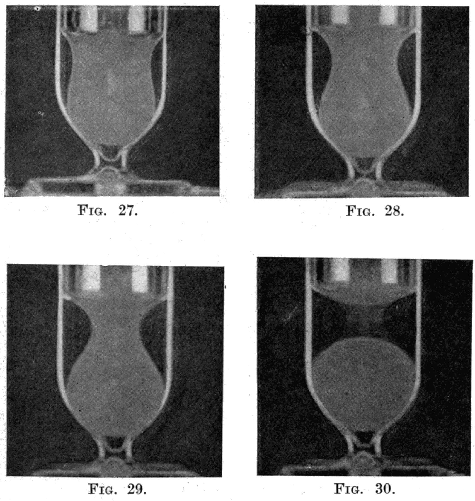

   :small-caps:`Figs.` 27, 28, 29, 30.—A liquid column stretched 
   upwards until broken by addition of water. Four stages.


It is possible, by using other liquids, and different
diameters of vessels, to produce columns of a large
variety of outlines. Some liquids spread over a
greater area on the surface of water than others, and
therefore produce columns with wider tops. Here we
see a column of orthotoluidine, which has a top diameter
of 2 inches; and here again, in contrast, is a
column of aceto-acetic ether, the surface diameter
of which is only ½ inch (`Fig. 31`_). Other liquids, such
as aniline, give an intermediate result. The lower
diameter is determined by the width of the vessel;
and hence we are able to produce an almost endless
[pg 43]
number of shapes. It is interesting to note how
workers in glass and pottery have unconsciously
imitated these shapes; and I have here a variety of
articles which simulate the outlines of one or other of
the liquid columns you have just seen. It is possible
that designers in these branches of industry might
[pg 44]
obtain useful ideas from a study of liquid columns,
which present an almost limitless field for the practical
observation of curved forms.


.. _`A column of aceto-acetic ether in water`:
.. _`Fig. 31`:

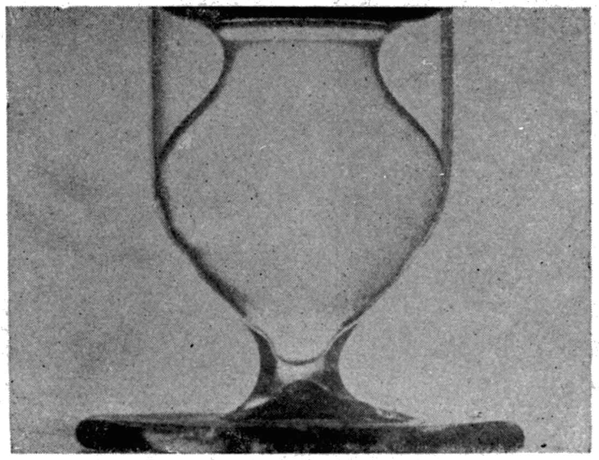

   :small-caps:`Fig.` 31.—A column of aceto-acetic ether in water.

.. _`Communicating Drops`:

**Communicating Drops.**—There is a well-known
experiment, which some of you may have seen, in which
two soap-bubbles are blown on separate tubes, and
are then placed in communication internally. If the
bubbles are exactly equal in size, no alteration takes
place in either; but if unequal, the smaller bubble
shrinks, and forces the air in its interior into the larger
one, which therefore increases in size. Finally, the
small bubble is resolved into a slightly-curved skin
which covers the end of the tube on which it was
originally blown. It is evident from this experiment
that the pressure per unit area exerted by the surface
of a bubble on the air inside is greater in a small than
in a large bubble. The internal pressure may be
[pg 45]
proved to vary inversely as the radius of the bubble;
thus by halving the radius we double the pressure due
to the elastic surface, and so on. The reciprocal of the
radius of a sphere is called its *curvature*, and we may
therefore state that the pressure exerted
by the walls of the bubble on the
interior vary directly as the curvature.

.. _`Apparatus for communicating drops`:
.. _`Fig. 32`:
.. _`32`:

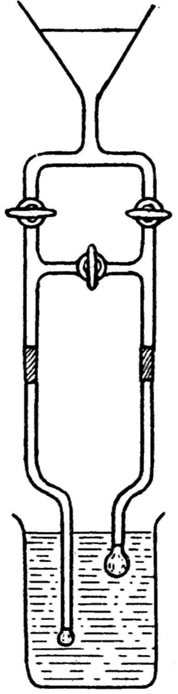

   :small-caps:`Fig.` 32.—Apparatus for
   communicating
   drops, with extensions
   of unequal
   length
   attached.

We have already seen that a drop of
liquid possesses an elastic surface, and
is practically the same thing as a
soap-bubble filled with liquid instead
of air. We might therefore expect the
same results if two suspended drops of
liquid were placed in communication
as those observed in the case of soap-bubbles.
And our reasoning is correct,
as we may now demonstrate. The
apparatus consists (`Fig. 32`_) of two
parallel tubes, each provided with a
tap, and communicating with a cross-branch
at the top, which contains a
reservoir to hold the liquid used.
About half-way down the parallel tubes
a cross-piece, provided with a tap, is
placed. We commence by filling the
whole of the system with the liquid
under trial, and the parallel tubes
equal in length. Drops are then
formed at the ends of each vertical
tube by opening the taps on these in turn, and closing
after suitable drops have been formed. Then, by
opening the tap on the horizontal cross-piece, we
[pg 46]
place the drops in communication and watch the
result.

I have chosen orthotoluidine as the liquid, and by
placing the ends of the vertical tubes under water—which
at the temperature of the room is slightly less
dense than orthotoluidine—I am able to form much
larger drops than would be possible in air. You
now see a small and a large drop projected on the
screen; and I now open the cross-tap, so that they
may communicate. Notice how the little drop shrinks
until it forms merely a slightly-curved prominence
at the end of its tube. It attains a position of rest
when the curvature of this prominence is equal to
that of the now enlarged drop which has swallowed up
the contents of the smaller one. So far the result is
identical with that obtained with soap-bubbles; but
we can extend the experiment in such a way as to
reverse the process, and make the little drop absorb the
big one. In order to do this I fasten an extension to
one of the tubes, and form a small drop deep down in
the water, and a larger one on the unextended branch
near the top. When I open the communicating top,
the system becomes a kind of siphon, the orthotoluidine
tending to flow out of the end of the longer tube. The
tendency of the large drop to siphon over is opposed
by the superior pressure exerted by the skin of the
smaller drop; but the former now prevails, and the
big drop gradually shrinks and the little one is observed
to grow larger. It is possible by regulating the depth
at which the smaller drop is placed, to balance the two
tendencies, so that the superior pressure due to the
lesser drop is equalled by the extra downward pressure
[pg 47]
due to the greater length of the column of which it
forms the terminus. Both pressures are numerically
very small, but are still of sufficient magnitude to
cause a flow of liquid in one or other direction when not
exactly in equilibrium. In the case of communicating
soap-bubbles, containing air and surrounded by air,
locating the small bubble at a lower level would not
reverse the direction of flow, which we succeeded in
accomplishing with liquid drops formed in a medium
of slightly inferior density.


.. _`Combined vapour and liquid drops`:
.. _`Fig. 33`:

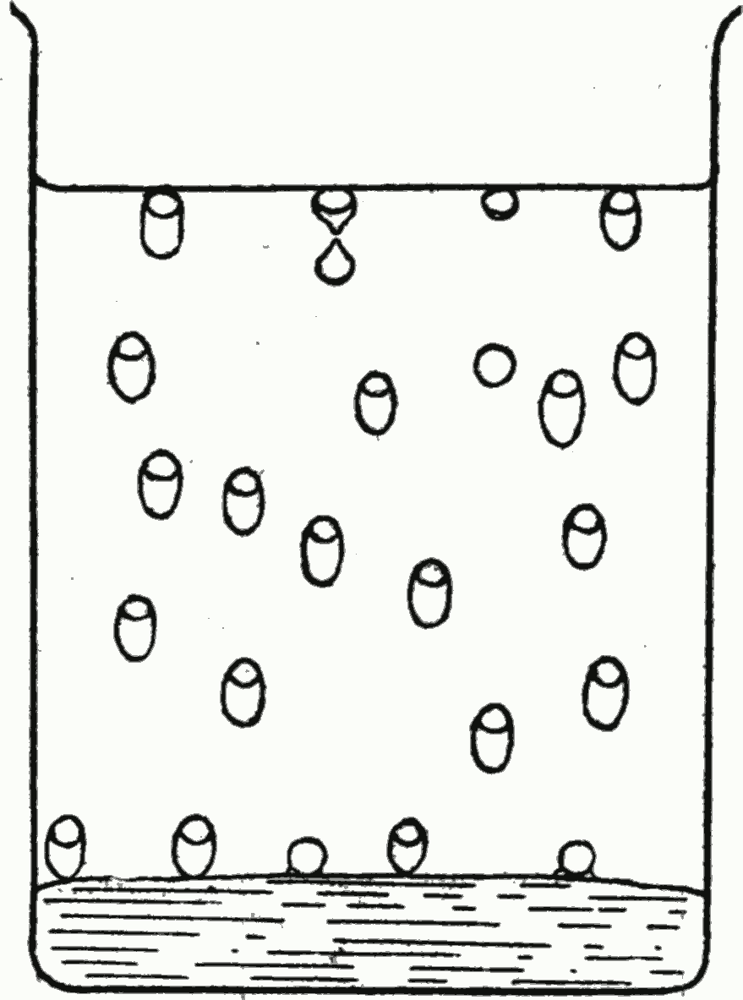

   :small-caps:`Fig.` 33.—Combined drops of vapour and liquid.

**Combined Vapour and Liquid Drops.**—All
liquids when heated give off vapour, the amount
increasing as the temperature rises. The vapour
formed in the lower part of the vessel in which the liquid
is heated rises in the form of bubbles, which may
condense again if the upper part of the liquid be cold.
When the liquid becomes hot throughout, however,
the vapour bubbles reach the surface and break,
allowing the contents to escape into the air above.
Everyone who has watched a liquid boiling will be
familiar with this process, but it should be remembered
that a liquid may give off large quantities of vapour
without actually boiling. A dish of cold water, if
exposed to the air, will gradually evaporate away;
whilst other liquids, such as petrol and alcohol, will
disappear rapidly under the same circumstances—and
hence are called “volatile” liquids.

The formation of vapour and its subsequent escape
at the surface of the liquid, enable us to produce a
very novel kind of drop; if, instead of allowing the
bubbles to escape into air, we cause them to enter a
second liquid. Here, for example, is a coloured layer
[pg 48]
of chloroform [#]_ at the bottom of a beaker, with a
column of water above. I project the image of the
beaker on the screen, and then heat it below. The
chloroform vapour escapes in bubbles; but notice
that each bubble carries with it a quantity of liquid,
torn off, as it were, at the moment of separation. The
vapour bubbles and their liquid appendages vary in
size, but some of them, you observe, have an average
density about equal to that of the water, and float
about like weighted balloons. Some rise nearly to
the surface, where the water is coldest; and then the
vapour partially condenses, with the result that its
lifting power is diminished, and hence the drops sink
into the lower part of the beaker. But the water
is warmer in this region, and consequently the vapour
bubble increases in size and lifting power until again
able to lift its load to the surface. So the composite
drops go up and down, until finally they reach the
surface, when the vapour passes into the air, and the
suspended liquid falls back to the mass at the bottom
of the beaker. Notice that the drop of liquid attached
to each bubble is elongated vertically. This is because
chloroform is a much denser liquid than water (`Fig. 33`_).
There is a practical lesson to be drawn from this experiment.
Whenever a bubble of vapour breaks through
the surface of a liquid, it tends to carry with it some
of the liquid, which is dragged mechanically into the
space above. In our experiment the space was
occupied by water, which enabled the bubble to detach
[pg 49]
a much greater weight than would be possible if the
surface of escape had been covered by air, which is far
less buoyant than water. But even when the bubbles
escape into air, tiny quantities of liquid are detached;
so that steam from boiling water, for example, is
never entirely free from liquid. All users of steam are
well acquainted with this fact.

.. [#] Mono-brom-benzene is better than chloroform for this
   experiment, but is more costly. It may be coloured with
   indigo. Chloroform may be coloured with iodine.


.. _`Condensation of Drops from Vapour`:

**Condensation of Drops from Vapour,—Mists,
Fogs and Raindrops.**—The atmosphere is the great
laboratory for the manufacture of drops. It is continually
receiving water in the form of vapour from
the surface of the sea, from lakes, from running water,
and even from snow and ice. All this vapour is
ultimately turned into drops, and returned again to
[pg 50]
the surface, and to this never-ceasing exchange all the
phenomena connected with the precipitation of moisture
are due. The atmosphere is only capable of
holding a certain quantity of water in the form of
vapour, and the lower the temperature the less the
capacity for invisible moisture. When fully charged,
the atmosphere is said to be “saturated”—a condition
realized on the small scale by air in a corked bottle
containing some water, which evaporates until the air
can hold no more. The maximum weight of vapour that
can be held by 1 cubic metre of air at different temperatures
is shown in the table:—

.. table::
   :class: norules
   :width: 100%
   :align: center
   :widths: 2 2 3
   :aligns: center center center

   +--------------------+--------------------------------+
   | Temperature.       | Weight of water vapour         |
   +---------+----------+ (grammes) required to saturate |
   | Deg. C. |  Deg. F. | 1 cubic metre.                 |
   +=========+==========+================================+
   |    0    |    32    |            4·8                 |
   +---------+----------+--------------------------------+
   |    5    |    41    |            6·8                 |
   +---------+----------+--------------------------------+
   |   10    |    50    |            9·3                 |
   +---------+----------+--------------------------------+
   |   15    |    59    |           12·7                 |
   +---------+----------+--------------------------------+
   |   20    |    68    |           17·1                 |
   +---------+----------+--------------------------------+
   |   25    |    77    |           22·8                 |
   +---------+----------+--------------------------------+
   |   30    |    86    |           30·0                 |
   +---------+----------+--------------------------------+
   |   35    |    95    |           39·2                 |
   +---------+----------+--------------------------------+
   |   40    |   104    |           50·6                 |
   +---------+----------+--------------------------------+


It will be seen from the table that air on a warm
day in summer, with a temperature of 77°\ |nbs| F., can hold
nearly five times as much moisture as air at the freezing
point, or 32°\ |nbs| F. The amount actually present, however,
is usually below the maximum, and is recorded
[pg 51]
for meteorological purposes as a percentage of the
maximum. Thus if the “relative humidity” at 77°\ |nbs| F.
were 70 per cent., it would imply that the weight of
moisture in 1 cubic metre was 70 per cent. of 22·8
grammes; that is, nearly 16 grammes. If 1 cubic metre
of air at 77°\ |nbs| F., containing 16 grammes of moisture, were
cooled to 50°\ |nbs| F., a quantity of water equal to (16-9·3) =
6·7 grammes would separate out, as the maximum content
at the lower temperature is 9·3 grammes. Precipitation
would commence at 66°\ |nbs| F., at which temperature 1
cubic metre is saturated by 16 grammes. And similarly
for all states of the atmosphere with respect to moisture,
cooling to a sufficient extent causes deposition of
water to commence immediately below the saturation
temperature, and the colder the air becomes afterwards
the greater the amount which settles out.
The temperature at which deposition commences is
called the “dew point.”

Whenever atmospheric moisture assumes the liquid
form, drops are invariably formed. These may vary
in size, from the tiny spheres which form a mist to the
large raindrops which accompany a thunderstorm.
But in every instance it is necessary that the air shall
be cooled below its saturation point before the separation
can commence; and keeping this fact in mind we
can now proceed to demonstrate the production of
mists and fogs. Here is a large flask containing some
water, fitted with a cork through which is passed a
glass tube provided with a tap. I pump some air into
it with a bicycle pump, and then close the tap. As
excess of water is present, the enclosed air will be
saturated. Now a compressed gas, on expanding into
[pg 52]
the atmosphere, does work, and is therefore cooled;
and consequently if I open the tap the air in the flask
will be cooled, and as it was already saturated the
result of cooling will be to cause some of the moisture
to liquefy. Accordingly, when I open the tap, the
interior of the flask immediately becomes filled with
mist. If we examine the mist in a strong light by the
aid of a magnifying glass, we observe that it consists
of myriads of tiny spheres of water, which float in the
air, and only subside very gradually, owing to the
friction between their surfaces and the surrounding air
preventing a rapid fall. The smaller the sphere, the
greater the area of surface in proportion to mass, and
therefore the slower its fall. And so in nature, the
mists are formed by the cooling of the atmosphere by
contact with the surface, until, after the saturation
point is reached, the surplus moisture settles out in
the form of tiny spheres, which float near the surface,
and are dissipated when the sun warms up the ground
and the misty air, and thus enables the water again to
be held as vapour.

Fogs, like mists, are composed of small spheres of
water condensed from the atmosphere by cooling; but
in these unwelcome visitors the region of cooling
extends to a higher level, and the lowering of temperature
is due to other causes than contact with the cold
surface of the earth. In our populous cities, the
density of the fogs is accentuated by the presence of
large quantities of solid particles in the atmosphere,
which arise from the smoke from coal fires, and the
abrasion of the roads by traffic. We can make a city
fog in our flask. I blow in some tobacco smoke, and
[pg 53]
then pump in air as before. You will notice that the
smoke, which is now disseminated through the air in
the flask, is scarcely visible; but now, on opening the
tap, the interior becomes much darker than was the
case in our previous experiment. We have produced
a genuine yellow fog, that is, a dense mist coloured by
smoke. When we have learned how to abolish smoke,
and how to prevent dust arising from the streets, our
worst fogs will be reduced to dense mists, such as are
now met with on the sea or on land remote from large
centres of habitation.

There is one feature common to the spheres which
compose a mist or fog, or indeed to any kind of drop
resulting from the condensation of moisture in the
atmosphere. As shown by the deeply interesting
researches of Aitken and others, each separate sphere
forms round a core or nucleus, which is usually a small
speck of dust, and hence an atmosphere charged with
solid particles lends itself to the formation of dense
fogs immediately the temperature falls below the dew-point.
But dust particles are not indispensable to
the production of condensed spheres, for it has been
shown that the extremely small bodies we call “ions,”
which are electrically charged atoms, can act as
centres round which the water will collect; and much
atmospheric condensation at high elevations is probably
due to the aid of ions. [#]_ Near the surface,
however, where dust is ever present, condensation
round the innumerable specks or motes is the rule.
[pg 54]
Here, for example, is a jet of steam escaping into air,
forming a white cloud composed of a multitude of
small spheres of condensed water. If now I allow
the steam to enter a large flask containing air from
which the dust has been removed by filtration through
cotton wool, no cloud is formed in the interior, but
instead condensation takes place at the end of the jet,
from which large drops fall, and on the cold sides of the
flask. The cloud we see in dusty air is entirely absent,
and the effect of solid particles in the process of condensation
is thus shown in a striking manner. Clouds
are masses of thick mist floating at varying heights in
the atmosphere. On sinking into a warmer layer of
dry air the particles of which clouds are composed will
evaporate and vanish from sight. If the condensation
continue, however, the spheres will grow in size until
the friction of the atmosphere is unable to arrest their
fall; and then we have rain. And whether the precipitation
be very gentle, and composed of small drops
falling slowly, as in a “Scotch mist,” or in the form of
rapid-falling large drops such as accompany a thunderstorm,
the processes at work are identical. Every
particle of a mist or cloud, and every raindrop, is
formed round a nucleus, and owes its spherical shape
to the tension at the surface.

.. [#] Mr. C. T. R. Wilson has recently devised an apparatus for
   making visible the tracks of ionizing rays, by the condensation
   of water vapour round the freshly liberated ions.

.. _`Liquid Clouds in Liquid Media`:

**Liquid Clouds in Liquid Media.**—Just as the
excess of moisture is precipitated from saturated air
when the temperature falls, so is the excess of one
liquid dissolved in another thrown down by cooling
below the saturation temperature. Moreover, a liquid
when precipitated in a second liquid appears in the
form of myriads of small spheres, which have the
[pg 55]
appearance of a dense cloud. Here is some boiling
water to which an excess of aniline has been added, so
that the water has dissolved as much aniline as it can
hold. Aniline dissolves more freely in hot water than
in cold, so that if I remove the flame, and allow the
beaker to cool, the surplus of dissolved aniline will
settle out. Cooling takes place most rapidly at the
surface, and you observe white streaks falling from
the top into the interior, where they are warmed up and
disappear. Soon, however, the cooling spreads throughout;
and now the streaks become permanent, and the
water becomes opaque, owing to the thick white cloud
of precipitated aniline. The absence of the red colour
characteristic of aniline is due to the extremely fine
state of division assumed in the process. If left for
some hours, the white cloud sinks through the water
to the bottom of the beaker, where the small particles
coalesce and form large drops, leaving the overlying
water quite transparent. The process is quite analogous
to the precipitation of moisture from the atmosphere
in the form of small spheres, which, if undisturbed,
would gradually sink to the ground and leave the air
clear.

.. _`Overheated Drops`:

**Overheated Drops.**—The temperature at which a
liquid boils, under normal conditions, depends only
upon the pressure on its surface. Thus water boiling in
air, when the pressure is 76 centimetres or 29·92 inches
of mercury, corresponding to 14·7 pounds per square
inch, possesses a temperature of 100°\ |nbs| C. or 212°\ |nbs| F.
At higher elevations, where the pressure is less, the
boiling point is lower; thus Tyndall observed that on
the summit of the Finsteraarhorn (14,000 feet) water
[pg 56]
boiled at 86°\ |nbs| C. or 187°\ |nbs| F. Conversely, under increased
pressure, the boiling point rises; so that at a pressure
of 35 pounds per square inch water does not boil until
the temperature reaches 125°\ |nbs| C. or 257°\ |nbs| F. There are
certain abnormal conditions, however, under which the
boiling point of a liquid may be raised considerably
without any increase in the pressure at the surface;
and it is then said to be “over-heated.” Dufour
showed that when drops of water are floating in
another liquid of the same density, they may become
greatly overheated, and if very small in size may attain
a temperature of 150°\ |nbs| C. or 302°\ |nbs| F., or even higher,
before bursting into steam. In order to provide a
medium in which water drops would float at these
temperatures, Dufour made a mixture of linseed oil
and oil of cloves, which possessed the necessary equi-density
temperature with water. To demonstrate
this curious phenomenon, I take a mixture of 4 volumes
of ethyl benzoate and 1 volume of aniline, which at
125°\ |nbs| C. or 257°\ |nbs| F. is exactly equal in density to water
at the same temperature. I add to the mixture two
or three cubic centimetres of freshly-boiled water, the
temperature being maintained at 125°\ |nbs| C. by surrounding
the vessel with glycerine heated by a flame. At
first the water sinks, but on attaining the temperature
of the mixture it breaks up with some violence, forming
spheres of various sizes which remain suspended in
the mixture. Any portion of the water which has
reached the surface boils vigorously, and escapes in
the form of steam; and some of the larger spheres
may be observed to be giving off steam, which rises to
the surface. Most of the spheres, however, remain
[pg 57]
perfectly tranquil, in spite of the fact that the water of
which they are composed is many degrees above its
normal boiling point. If I penetrate one of these
spheres with a wire, you notice that it breaks up immediately,
with a rapid generation of steam. A complete
explanation of this abnormal condition of water is
difficult to follow, as a number of factors are involved.
One of the contributory causes—though possibly a
minor one—is the opposition offered to the liberation of
steam by the tension at the surface of the spheres.


.. _`Spheroid of water on a hot plate`:
.. _`Fig. 34`:

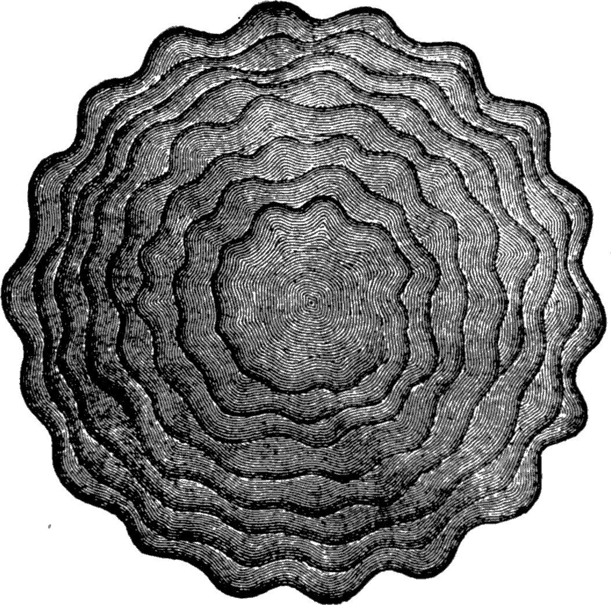

   :small-caps:`Fig.` 34.—Spheroid of water on a hot plate.

.. _`Floating Drops on Hot Surfaces`:

**Floating Drops on Hot Surfaces.**—If a liquid
be allowed to fall in small quantity on to a very hot
solid, it does not spread out over the surface, but
forms into drops which run about and gradually evaporate.
By careful procedure, we may form a very large,
flattened drop on a hot surface, and on investigation
we shall notice some remarkable facts. I take a plate
of aluminium, with a dimple in the centre, and make
it very hot by means of a burner. You see the upper
surface of this plate projected on the screen. I now
allow water to fall on the plate drop by drop, and you
hear a hissing noise produced when each drop strikes
the plate. The separate drops gather together in
the depression at the centre of the plate, forming a
very large flattened globule. You might have expected
the water to boil vigorously, but no signs of
ebullition are visible; and what is more remarkable,
the temperature of the drop, in spite of its surroundings,
is actually less than the ordinary boiling point. Notice
now how the drop has commenced to rotate, and has
been set into vibration, causing the edges to become
scalloped (`Fig. 34`_). The drop, although not actually
[pg 58]
boiling, is giving off vapour rapidly, and therefore
gradually diminishes in size. And now I want to
prove that the drop is not really touching the plate,
but floating above it. To do this I make an electric
circuit containing a cell and galvanometer, and connect
one terminal to the plate and place the other in
the drop. No movement is shown on the galvanometer,
as would be the case if the drop touched the
plate and thus completed the electric circuit. And
at close range we can actually see a gap between the
drop and the plate, so that the evidence is conclusive.
If now I remove the flame—leaving the electric circuit
intact—and allow the plate to cool, we notice after a
time that the globule flattens out suddenly and touches
the plate, as shown by the deflection of the galvanometer;
[pg 59]
and simultaneously a large cloud of steam arises,
due to the rapid boiling which occurs immediately
contact is made.

What we have seen in the case of water is shown by
most liquids when presented to a surface possessing a
temperature much higher than the boiling point of
the liquid. A liquid held up in this manner above a
hot surface is said to be in the *spheroidal state*, to
distinguish it from the flat state usually assumed by
spreading when contact occurs between the liquid
and the surface. It is doubtful whether any satisfactory
explanation of the spheroidal state has ever been
given. Evidently, the layer of vapour between the
plate and the drop must exert a considerable upward
pressure in order to sustain the drop, but the exact
origin of this pressure is difficult to trace.

[pg 60]


LECTURE III
===========

.. _`Spreading of Oil on the Surface of Water`:

**Spreading of Oil on the Surface of Water.**—If
a small drop of oil be placed on the surface of water
it will be observed to spread immediately until it forms
a thin layer covering the surface. If a further addition
of the oil be made, globules will be formed, which, as
you now see upon the screen, remain floating on the
surface. The spreading of the oil in all directions from
the place on which the small quantity of oil was dropped
is due to the superior surface tension of water, which
pulls the oil outwards. The surface tension of the oil
opposes that of the water, and would prevent the drop
from spreading were it not overcome by a greater force.
The result is the same as would be observed if the centre
or any other part of a stretched rubber disc were
weakened; the weak part would be stretched in all
directions, and the rest of the disc would shrink
towards the sides. When the oil has spread out, however,
and contaminated, as it were, the surface of the
water, the surface tension is reduced, and is not sufficiently
strong to stretch out a further quantity of oil,
which, if added, remains in the form of a floating
globule.

.. _Forces acting on a floating globule:
.. _`Fig. 35`:

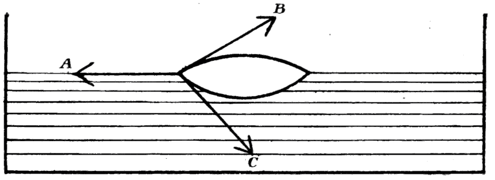

   :small-caps:`Fig.` 35.—Forces acting on a floating globule.

Let us study the forces at work on the floating
globule a little more closely. Its upper surface is in
[pg 61]
contact with air, and the surface tension tends, as usual,
to reduce the area to a minimum. The top of the
globule is not flat, but curved (`Fig. 35`_), and its surface
meets that of the water at an angle; and the counter-pull
exerted against the stretching-pull of the water
surface is not horizontal, but inclined in the direction
of the angle of contact, as shown by the line B. The
under part of the globule is also curved, and meets
the water surface from below at an angle; and here
also is exerted a pull in opposition to that of the water
surface, different in magnitude to the force at the
upper surface, but also directed at the angle of contact
as shown by the line C. This tension at the joining
surface of two liquids is called the “interfacial” tension,
to distinguish it from that of a surface in contact
with air. Acting against these two tensions is that of
the water, which is directed horizontally along the surface,
as shown by the line A. The lines A, B, and C
indicate the forces acting at a single point; but the
same forces are at work at every point round the circle
of contact of the globule and the surface of the water.
And therefore the tendency on the part of the water
[pg 62]
tension is to cause the globule to spread out in all
directions, whereas the other two tensions tend to prevent
any enlargement of its surface. The result depends
upon the magnitudes and directions of the conflicting
forces. We can imagine a kind of tug-of-war taking
place, in which one contestant, A, is opposed to two
others, B and C, all pulling in the directions indicated
in `Fig. 35`_. Although A is single-handed, he has the
advantage of a straight pull, whereas B and C can only
exert their strength at an angle, and the larger the angle
the more they are handicapped. If A be more powerful
than B and C, the globule will spread; but the result
of the spreading is to diminish the angles at which the
pulls of B and C are inclined to the surface, and hence
their effective opposition to A will be increased. Moreover,
the spreading of the liquid diminishes the surface
tension of the water—that is, weakens A—and hence
it becomes possible for B and C to prevail and draw
back the surface of the globule which A had previously
stretched. If, in spite of these disabilities, A should
still be the stronger, the globule will be stretched until
it covers the whole surface; whereas if B and C overcome
A, the globule will shrink, increasing the angles at
which B and C operate, and therefore reducing their
effective pulls, until their combined strength is equal
to that of A, when the globule will remain at rest.
Bearing these facts in mind, we can understand why a
small drop of oil placed on a clean water surface spreads
across; for in this case A is stronger than B and C
combined. But when the surface of the water is
covered with a layer of oil, A is weakened, and can no
longer overcome the opposing pulls of B and C. Hence
[pg 63]
a further drop of oil poured on to the surface remains
in the form of a globule.

.. _`Movements due to Solubility`:

**Movements due to Solubility.**—When small
fragments of camphor are placed on the surface of water
some remarkable movements are seen. [#]_ The bits of
camphor move about with great rapidity over the
surface, and generally, in addition, show a rapid rotary
motion. The explanation usually given is that the
camphor dissolves in the water at the points of contact
forming a solution which possesses a less surface tension
than pure water. This solution is in consequence
stretched by the tension of the rest of the surface, and
the camphor floating on its solution is therefore made
to move in the direction of the line along which the
stretching force happens to be the greatest. But the
camphor continues to dissolve wherever it goes, and
is therefore continuously pulled about as a result of
this interplay of tensions. Touching the surface with a
wire which has been dipped in oil immediately arrests
the movements, owing to the tension of the water
being diminished to such an extent by the skin of oil
that it is no longer competent to stretch the part on
which the camphor floats. No doubt this explanation
is correct so far as it goes, but it is highly probable that
when the floating substance dissolves, other forces
are called into action in addition to the tensions.

.. [#] These movements were first recorded by Romieu in 1748
   and were ascribed by him to electricity.


.. _`Aniline globules on a water surface`:
.. _`Fig. 36`:

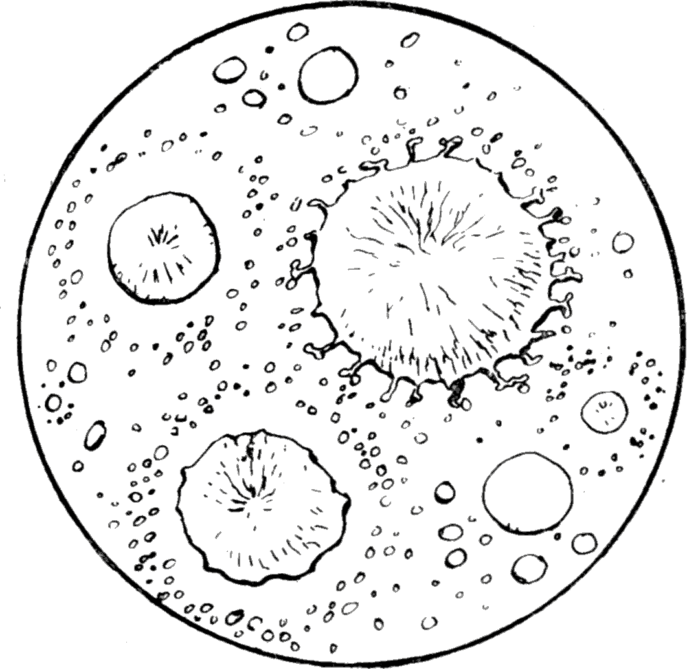

   :small-caps:`Fig.` 36.—Aniline globules on a water surface.

.. _`Movements of Aniline Globules on a Water Surface`:

**Movements of Aniline Globules on a Water Surface.**—If
we allow a small quantity of aniline to run
on to the surface of water, it forms itself into a number
of floating globules. I now project on the screen a
[pg 64]
water surface on which a little aniline has been poured,
and we are thus enabled to watch the movements
which occur. All the globules appear to be twitching
or shuddering; and if you observe closely you will
notice the surface of each globule stretching and
recoiling alternately. The recoil is accompanied by
the projection of tiny globules from the rim, which
becomes scalloped when the globule is stretched. The
small globules thrown off appear to be formed from the
protuberances at the edge (`Fig. 36`_), and after leaving
the main globule they spread out over the surface,
or dissolve. This process continues for a long time,
gradually diminishing in vigour, until small stationary
globules are left floating on the surface, which is
now covered with a skin of aniline. This action is in
[pg 65]
striking contrast to the tranquil formation of floating
globules of oil, and calls for some special comment.

Let us recall again the three forces at work at the
edge of a floating globule (`Fig. 35`_). The surface tension
of the water, acting horizontally, tends to stretch
the globule, and is successful momentarily in overcoming
the opposing tensions, each of which pulls at an
angle to the surface. Enlargement of the upper surface
of the globule, however, reduces the angles at
which the tensions B and C act, and in consequence
their effective strength is increased. The spreading
of the aniline over the water surface diminishes the
pull A, which B and C combined now overcome, and
hence the surface of the globule shrinks again. For
some unexplained reason both the stretching and recoil
of the globule occur suddenly, there being an interval
of repose between each, and these jerky movements
result in small portions of the rim being detached, each
of which forms a separate small globule. The aniline
which spreads over the surface of the water dissolves,
and the water tension A, which had been enfeebled
by the presence of the aniline skin, recovers its former
strength, and again stretches the globule; and so the
whole process is repeated. When the surface of the
water becomes permanently covered with a skin, which
occurs when the top layer is saturated with aniline,
the globule remains at rest, and has such a shape that
the tensions B and C act at angles which enable them
just to balance the weakened pull of A. Why the
edge of the globule becomes indented during the movements,
and why these movements are spasmodic
instead of gradual, has not been clearly made out. It
[pg 66]
is interesting to recall that a spheroid of liquid on a hot
plate also possesses a scalloped edge, and it may be
that the two phenomena have something in common.


.. _`Orthotoluidine globules on a water surface`:
.. _`Fig. 37`:

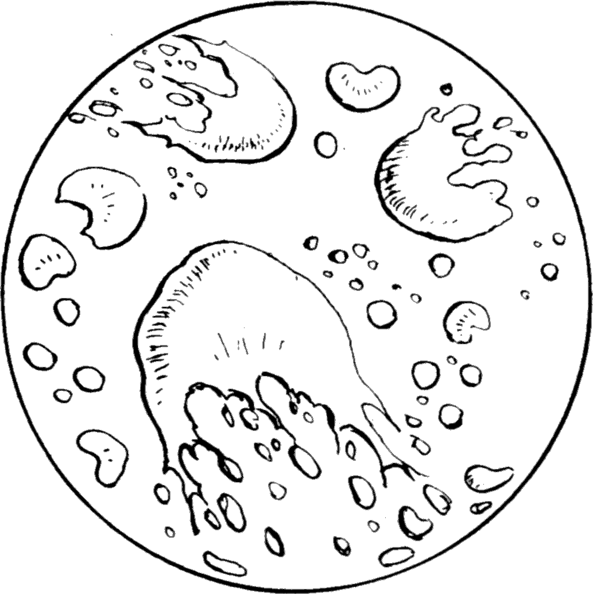

   :small-caps:`Fig.` 37.—Orthotoluidine globules on a water surface.

.. _`Movements of Orthotoluidine and Xylidine 1-3-4 on a Water Surface`:

**Movements of Orthotoluidine and Xylidine
1-3-4 on a Water Surface.**—We will now observe,
by the aid of the lantern, movements of globules more
striking, and certainly more puzzling, than those of
aniline. I place on the surface of the water a quantity
of a special sample of orthotoluidine, and you see that
immediately a number of globules are formed which
are endowed with remarkable activity. They become
indented at one side, and then dart across the surface
at a great speed, usually breaking into two as a result
of the violent action (`Fig. 37`_). Then follows a short
period of rest, when suddenly, as if in response to a
[pg 67]
signal, all the larger globules again become indented,
forming shapes like kidneys, and again shoot across
the surface, breaking up into smaller globules. Notice
that the very small globules remain at rest; it is only
those above a certain size that display this remarkable
activity. A film of the liquid forms on the water,
and the action gradually becomes more intermittent,
ceasing altogether when a skin is well established, and
the large globules have sub-divided into very small
ones. My sample of orthotoluidine is somewhat unique,
as other specimens of the liquid, obtained from the
same and other sources, do not show the same lively
characteristics. As in the case of camphor, touching
the surface with a drop of oil arrests the movements
immediately. The organic liquid *xylidine* 1-3-4,
however, exhibits the same movements, as you now see
on the screen; and, if anything, is even more active
than the orthotoluidine previously shown. It may be
added that occasional samples of aniline show similar
movements, but of less intensity.

Now if I am asked to explain these extraordinary
movements, I am bound to confess my inability to do so
at present. Why should the globules become indented
on one side only? The two tensions acting at the
edge in opposition to the water tension are at work all
round the globule, and it is not easy to see why they
should prevail to such a marked degree at one spot only.
The movement across the surface, if we followed our
previous explanations, would be due to the superior
pull of the water tension behind the globule, opposite
the indented part; although to look at it would seem
as if some single force produced the indentation and
[pg 68]
pushed the globule along bodily. Are there local
weaknesses in the tension of the water, and, if so, why
should such weak spots form simultaneously near each
globule, causing each to move at the same moment?
Any explanation we may give as to the origin of the
cavity in the side of the globule does not suffice to
account for the intermittent character of the movement,
and its simultaneous occurrence over the whole
surface. We must therefore leave the problem at
present, and trust to future investigation to provide
a solution.

.. _`Resolution of a floating skin into globules`:
.. _`Fig. 38`:

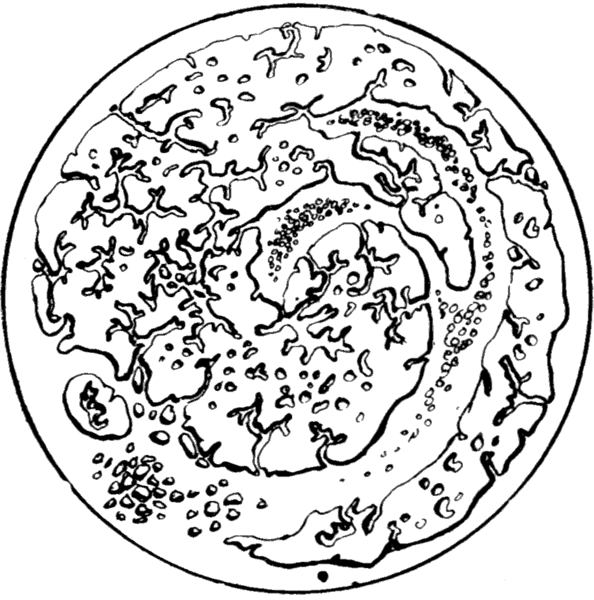

   :small-caps:`FIG. 38.`—Resolution of a floating skin into globules.


.. _`Production of Globules from Films`:

**Production of Globules from Films.**—When a 
film of oil spreads over a water surface it sometimes
remains as such indefinitely. Certain other liquids,
however, form films which after a short interval 
break up into globules, and the process of transition
[pg 69]
is at once striking and beautiful. In order to show it, I
project a water surface on the screen, and pour on to it
a very small quantity of *dimethyl-aniline*—an oily
liquid related to but distinct from ordinary aniline.
It spreads out into a film of irregular outline, which
floats quietly for a short time. Soon, however, indentations
are formed at the edges, which penetrate the
film, and from the sides of the indentations branches
spread which in turn become branched; and shortly
the whole film becomes ramified, resembling a mass of
coral, or, to use a more homely illustration, a jig-saw
puzzle (`Fig. 38`_). The various branches join in numerous
places, cutting off small islands from the film; and
immediately each island becomes circular in outline—and
the resolution into globules is complete. We
have witnessed one of the beauty-sights of Nature.

The same method of globule formation is shown by
nitro-benzol and *quinoline*, and as the action is more
gradual in the case of the latter substance, I show it in
order that we may study the process in greater detail.
Notice the formation of the indentations and their
subsequent branching; and also that holes form in the
skin from which branchings also proceed. In this instance
the film is broken up in sections, but the action
continues until nothing but globules remain on the
surface. [#]_

It is not easy to see why the canals of water penetrate
the film and split it up into small sections, nor why
entry takes place at certain points on the edge in
[pg 70]
preference to others. Some orderly interplay of forces,
not yet properly understood, gives rise to the action;
and a satisfactory explanation has yet to be given.

.. [#] The breaking-up of films on the surface of water was first
   noticed by Tomlinson about 50 years ago. He used essential
   oils, and called the patterns “cohesion figures.”

.. _`Network formed from a Film`:

**Network formed from a Film.**—A further example
of the breaking up of a film is furnished by certain
oils derived from coal-tar, the result in this case being
the formation of a network or cellular structure.
I place on the surface of water in a glass dish a small
quantity of tar-oil, and project it on the screen. It
spreads out at first into a thin film, which, by reflected
light, shows a gorgeous display of colours. After a
short time, little holes make an appearance in the film,
and these holes gradually increase in size until the
whole of the film is honeycombed (`Fig. 39`_), the oil
having been heaped up into the walls which divide
the separate compartments. Here again the accepted
views on surface tension do not appear competent to
explain the action. It appears to be the case that most
films on the surface of water show this tendency to
[pg 71]
perforation, which may be due to inequalities in the
thickness of the film, or in the distribution of the strain
to which it is subjected. [#]_

.. [#] An interesting discussion on cellular structures of this
   type may be found in *Nature*, April 16 to June 11, 1914.

.. _`Network formed from a film of tar-oil`:
.. _`Fig. 39`:

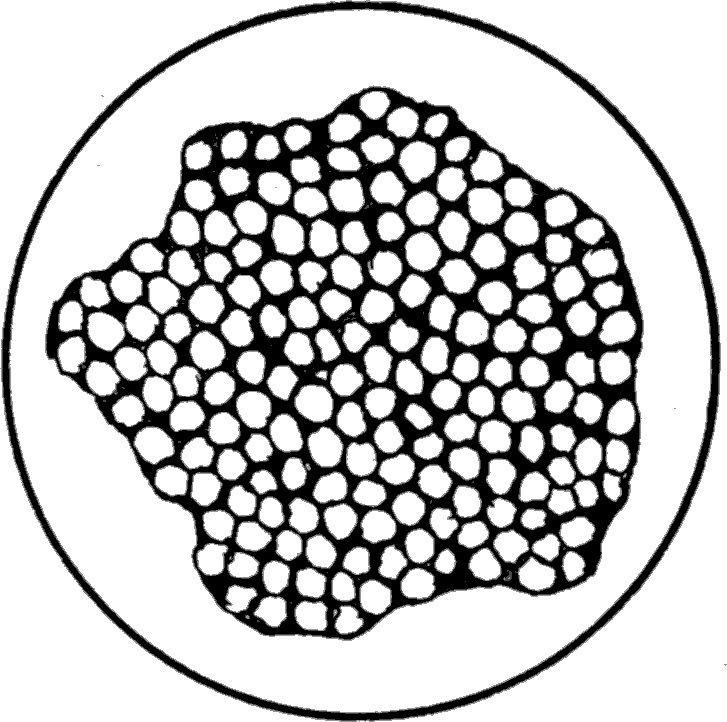

   :small-caps:`Fig.` 39.—Network formed from a film of tar-oil on the
   surface of water.


.. _`Quinoline rings and perforated plates`:
.. _`Fig. 40`:

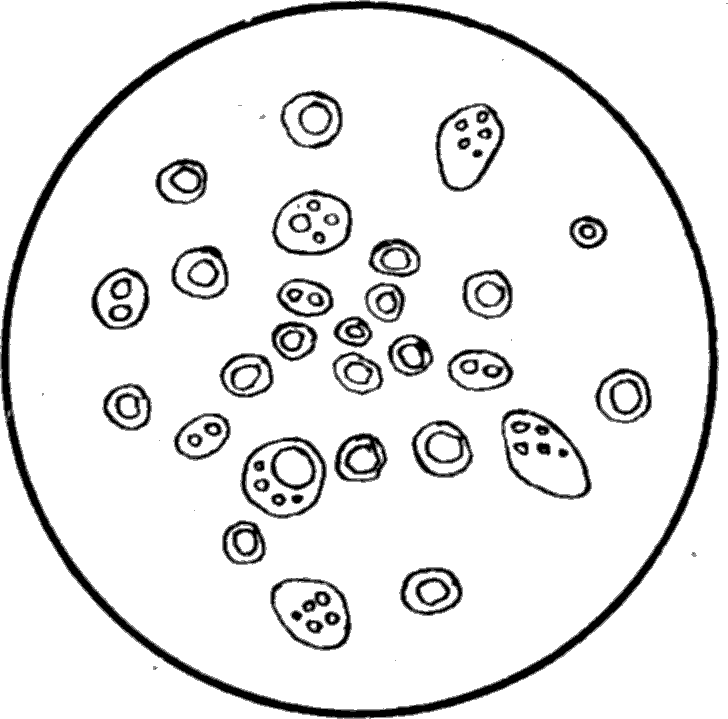

   :small-caps:`Fig.` 40.—Quinoline rings and perforated plates.

.. _`Quinoline Rings`:

**Quinoline Rings.**—Reference has already been
made to the breaking-up of a quinoline film into globules.
But if we examine the surface about half an
hour after the formation of these globules, we find that
each has been perforated in the centre, forming a ring
or annulus (`Fig. 40`_). Some of the larger globules
have undergone perforation in several places, forming
honeycombed plates. These rings and plates, which
you now see projected on the screen, remain unchanged,
and apparently represent the final stage of equilibrium
under the action of the various forces. Quinoline, so
far as observations have been made, appears to be
unique in respect to the formation of stable rings from
globules.


.. _`The expanding globule`:
.. _`Fig. 41`:

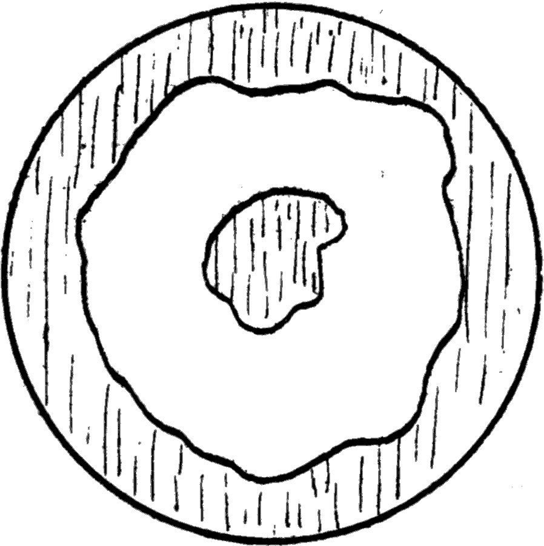

   :small-caps:`Fig.` 41.—The expanding globule.

.. _`Expanding Globules`:

**Expanding Globules.**—I now wish to show, by an
[pg 72]
experiment, how sensitive a floating globule is to disturbances
in the existing tensions, which maintain
it at rest. On the screen is projected a globule of
dimethyl-aniline, floating tranquilly on the surface of
water. I now allow a small drop of quinoline to fall
upon it, and immediately it spreads out over the surface,
forming a hole in its centre (`Fig. 41`_), after which
it gradually resumes its former shape. Sometimes
the action is so violent that the globule is split up into
several portions, which, however, join together again
after a short time. In order to explain this action, we
must again refer to the three tensions operating on the
globule (`Fig. 35`_). When in equilibrium, A is balanced
by the joint pull of B and C; and hence if either of the
latter be weakened, A will predominate and stretch
the globule. In our experiment it is the interfacial
tension, C, which has been diminished in strength,
as we may now prove by a second experiment. In this
[pg 73]
instance I float on the water surface a globule of lubricating
oil, with which quinoline does not readily mix,
and which does not act so immediately as dimethyl-aniline.
On allowing the drop of quinoline to fall into
it, no action is observed until the drop has rested on
the junction of the oil and water for a short time; but
when it has penetrated the interface the oil globule
suddenly spreads over the water surface, and with such
violence as to detach several portions from the main
globule. Merely touching the upper surface of the oil
with a rod moistened with quinoline has no effect,
and hence the result is due to the weakening of the
interfacial tension. A similar effect is obtained when
quinoline is dropped into a globule of aniline, and may
be obtained with various other liquids.

.. _`Attraction between Floating Globules`:

**Attraction between Floating Globules.—The
“Devouring” Globule.** When globules of different
liquids are floating on the same water surface, a tendency
to coalesce is sometimes noticed, but is by no
means general. I will show one example which possesses
striking features, showing as it does the remarkable
results which may be brought about by surface
forces. First of all, we form a number of active
orthotoluidine globules on the surface of a dish of
water, which you see wriggling about in their characteristic
fashion. After their activity has subsided
somewhat, I float on to the surface a large globule of
dimethyl-aniline. Attraction of some kind is at once
apparent, for the nearest globule of orthotoluidine
immediately approaches the intruder. And now comes
the process of absorption. The large globule of
dimethyl-aniline develops a protuberance in the direction
[pg 74]
of its victim (`Figs. 42 and 43`_), and the small
globule of orthotoluidine coalesces with this _`“feeler,”`
which then shrinks back into the large globule, conveying
with it the entangled orthotoluidine. This, however,
by no means satisfies the devouring globule, as a
second victim is at once appropriated in the same
manner; and you will notice a nibbling process at
work round the edges continuously, which is due to the
absorption of the smaller globules of orthotoluidine.
The action continues until the whole of the surface has
been cleared of orthotoluidine, after which the large
globule floats tranquilly in the centre of the vessel,
apparently resting after its heavy meal. The interaction
[pg 75]
of the forces which gives rise to this phenomenon
is difficult to fathom; there are no doubt several
tensions, constantly changing in magnitude, which in
the result cause the liquids of the large and small
globules to intermingle. Separate globules of a single
liquid sometimes unite in this manner, but this is
not common, it being more usual for the scattered units
to remain apart.


.. _`The “devouring” globule. Five stages`:
.. _`Fig. 42`:
.. _`Figs. 42 and 43`:

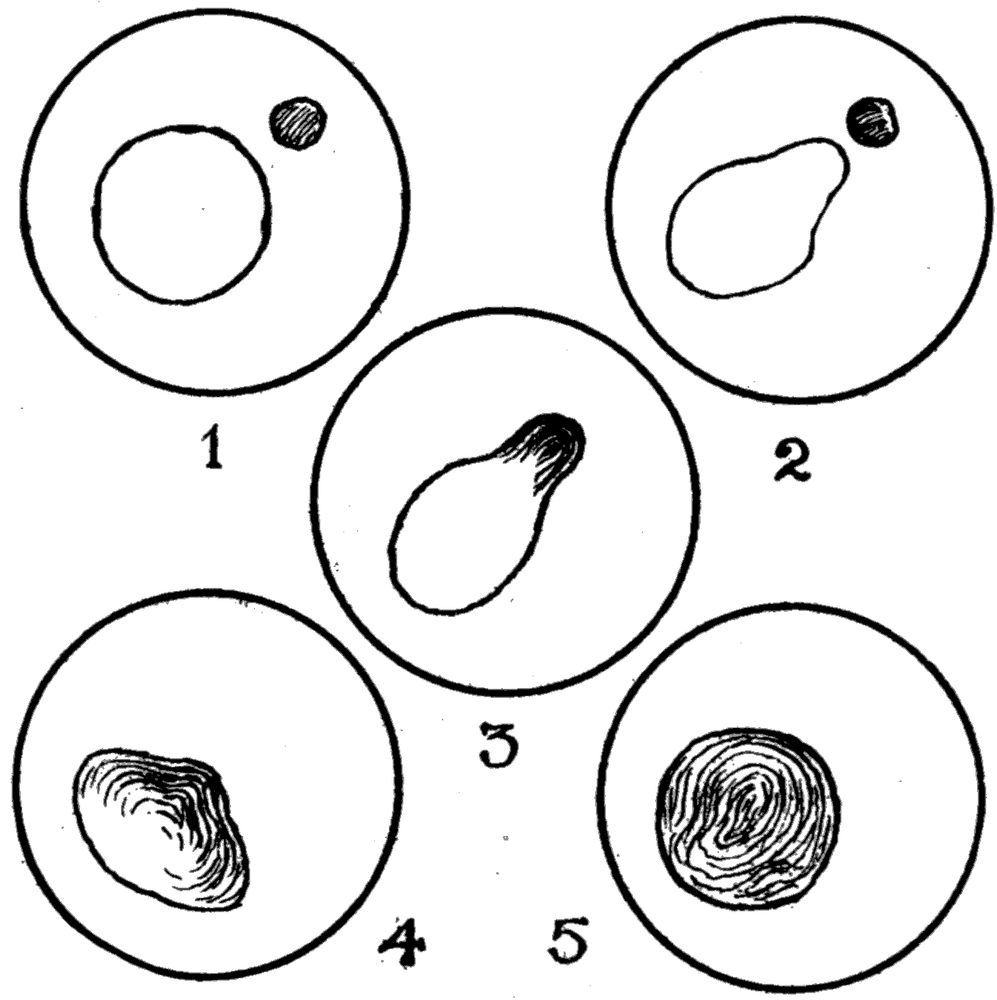

   :small-caps:`Fig.` 42.—The “devouring” globule. Five stages.


.. _`Photograph of one globule absorbing another`:
.. _`Fig. 43`:

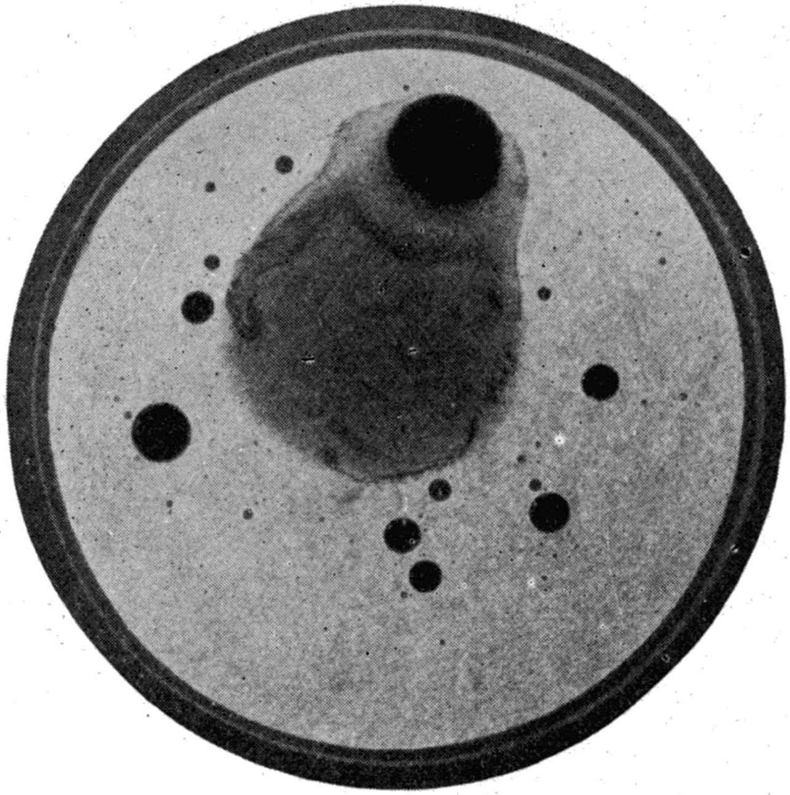

   :small-caps:`Fig.` 43.—Photograph of one globule absorbing another.

.. _`Analogies of Surface Tension Phenomena with Life`:

**Analogies of Surface Tension Phenomena with
Life.**—When we watch the movements of globules
on the surface of water, the resemblance to the antics
of the lower forms of life immediately occurs to our
[pg 76]
minds. Now I do not intend here to intrude any
opinion on the much-discussed subject of the Origin
of Life, but merely to point out that certain phenomena,
usually supposed to be associated only with living
things, may result from the interplay of surface tensions.
In our experiments we have witnessed expansive
and contractile motion (aniline globules on water);
movement of translation, of a very vigorous kind
(xylidine and orthotoluidine globules); incorporation of
external matter, or feeding (dimethyl-aniline absorbing
orthotoluidine)—we are getting quite familiar with
these long names now—, splitting up of masses, or
division (skins of quinoline, etc., breaking up into
branched portions, and sub-division of large globules);
and formation of cellular structure (tar-oil on water).
And the conclusion we may legitimately draw is this:
that mechanical forces may account for many observed
phenomena in connexion with life which formerly were
attributed to the action of “vital” forces. Modern
biological research all points in the same direction,
and it seems probable that the operations of the animate
and inanimate are controlled by the same forces. But
the mystery of Life still remains.

.. _`Conclusion`:

**Conclusion.**—I have endeavoured in these lectures
to bring to your notice some of the remarkable results
which may be produced by the use of water and a few
other liquids, and the scientific conclusions which may
be drawn from them. It may be that the phenomena
we have considered have little or no commercial application;
but science has other uses in addition to its
fruitful alliance with commerce. The study of the
[pg 77]
methods by which Nature achieves her ends stimulates
the imagination and quickens the perceptions, and is
therefore of the highest educational value. It is a
great scientific achievement to run a railway to the
summit of the Jungfrau, but we should not envy the
mental condition of the individual to whom that
glorious mountain appealed only through the railway
dividends. And I trust that we shall never become so
imbued with the industrial aspects of science, as to
lessen our appreciation of the works of Nature, whether
manifested in the snow-clad peak or the equally wonderful
drop of water.

[pg 78]


APPENDIX
========

_`Apparatus and Materials required for Experiments on Drops and Globules`.
--------------------------------------------------------------------------

**Vessels.**—For direct observation of liquid spheres,
large drops, etc., beakers about 6 inches in height and
4 inches in diameter are suitable. It must be remembered,
however, that a beaker containing water behaves
like a cylindrical lens, and hence objects in the
interior appear distorted in shape. In order to observe
the true dimensions, flat-sided vessels must be used, in
which the faces are of uniform thickness. Glass battery-vessels,
which are made of a single piece of glass, have
sides of irregular thickness, and are not to be recommended.
A useful form of vessel is one in which the
bottom and edges are made of copper, the sides being
formed of windows of plate glass cemented to the copper
framework. Water may be boiled in such a vessel without
danger to the glass, starting with cold water; it is
not advisable to pour hot water into the cold vessel,
however, as the glass may crack. Suitable dimensions
for a vessel of this kind are 6 inches high, and 4 inches
in width and thickness. A beaker containing water,
in which drops are formed may be placed in this square
vessel, and surrounded by water, when distortion will be
absent; and the whole of the contents may be kept hot—as
required, for example, with the automatic aniline
[pg 79]
drop. It is best to conduct the experiments in beakers
immersed as described, as the materials used may then be
easily recovered without having to clean out the flat vessel.

For the formation of liquid columns, test-tubes, of
diameter 1 to 2 inches, or small beakers, may be used.
Test-tubes provided with a foot, which will stand
upright, are most satisfactory; and the true shape may
be seen by immersing the test-tube or beaker in water
in a flat-sided vessel of the form described above. The
effect of heat on the shape of the column may be observed
by warming the water in the vessel. The centrifugoscope
(`Fig. 7`_) and the apparatus depicted in
Figs. `8`_, `13`_, and `32`_, may be procured from the makers,
Messrs. A. Gallenkamp & Co., Sun Street, E.C.

Experiments with skins and globules may be conducted
in beakers of about 4 inches diameter, or in
small porcelain photographic dishes. If intended for
lantern projection shallow cells, with a bottom of plate
glass, are necessary, and may be obtained from dealers
in scientific apparatus.

**Materials.**—Sufficient quantities of the various
liquids used may be procured from dealers in chemicals
at a small cost. Aniline and orthotoluidine, which
figure largely in the experiments, should be obtained
in the “commercial” form, which is the cheapest
and most suitable. The remaining liquids should be
of the variety described as “pure” in the catalogues.
When used for the formation of films, they should be
kept in bottles in which the glass stopper is prolonged
into a tapered rod, which dips into the liquid, and which,
on removal, carries a convenient quantity of liquid
to drop on to the water surface.

[pg 80]

Accessories such as glass rods, plates, tubing of
various diameters, thin copper wire, and an aluminium
plate for the spheroidal state, can be obtained from
any dealer in apparatus; and the same applies to
clamp-stands for holding funnels, etc.

**Water.**—Ordinary tap-water suffices for all the
experiments described, and for work with films and
globules is superior to distilled water, which often
possesses a surface so greasy as to retard or even entirely
prevent the desired result. All experiments conducted
on the surface of water should be performed in
a clean vessel which has been rinsed out several times
with tap-water before filling.

**Lantern Projection.**—In demonstrating the phenomena
to an audience, a lantern may be used to advantage.
It should be of the type now procurable, which
is arranged for the projection of experiments conducted
either in a horizontal or vertical position, by the use
of the electric arc or other suitable source of light.
Flat-sided vessels are essential for the successful projection
of views of objects in a vertical position; and for
showing globules, etc., on the surface of water, better
definition is secured if cells with plate-glass bottoms are
used instead of vessels made of a single piece of glass.
The author has generally used a “Kershaw” lantern
for lecture purposes, with quite satisfactory results.
This lantern may also be adapted for projecting solid
objects by reflected light—as, for example, a hot plate
on which a spheroid of water is floating (`Fig. 34`_). The
contrivance known as the “Mirrorscope” may also
be used, with slight modification, for producing a
magnified image of solid objects on the screen.

[pg 81]


INDEX
=====

.. |"| replace:: |nbs|\ ”\ |nbs3|\ |nbs2|

..

   | |nbs6| |nbs6| |nbs6| |nbs6| |nbs3| A |nbs3| |nbs6| |nbs6|  :small:`PAGE`

| Aceto-acetic ether, automatic drops of, |...| [pg 37]_
|  |"| columns of, |...| |...| [pg 44]_
| Aniline, automatic drops of,      |...| |.| [pg 33]_
|  |"| equi-density temperature of,  |...| [pg 17]_
|  |"| films or skins,   |...| |..| [pg 19]_
|  |"| globules, movements of,       |...| [pg 63]_
| Anisol,   |...| |...| |..| [pg 19]_
| Area of stretched surfaces, |...| |..|  [pg 7]_

.. class:: center

   | B

| Boundary surface of two liquids,  |...| |.|  [pg 6]_
| Butyl benzoate, |...| |...| |.| [pg 19]_


.. class:: center

   | C

| Camphor, movements of on the surface of water,      |.| [pg 63]_
| Centrifugoscope,      |..| |...| |.| [pg 14]_
| Chloroform, composite drops of,   |...| |.| [pg 48]_

.. class:: center

   | D

.. _`Drops of liquid, shapes of, 10, 29, 30, 31`:

| Dimethyl-aniline, skin of on water,     |...| [pg 68]_
| “Diving” drop,  |...| |...| |.| [pg 22]_
| Droplet, formation of,      |...| |.|   [pg 28]_, [pg 34]_
| Drops of liquid, apparatus for,   |.| |...| [pg 27]_
|  |"| |"| automatic,      |...|   [pg 33]_, [pg 37]_
|  |"| |"| combined with vapour,       |..| [pg 47]_
|  |"| |"| communicating,        |...| [pg 44]_
|  |"| |"| condensation of from vapour,      |.| [pg 49]_
|  |"| |"| floating on hot surface,    |..| [pg 57]_
|  |"| |"| formation of,   |..|     [pg 24]_, [pg 33]_, [pg 37]_
|  |"| |"| overheated,     |...| |.| [pg 55]_
|  |"| |"| shapes of,      |..| [pg 10]_, [pg 29]_, [pg 30]_, [pg 31]_


[pg 82]

.. class:: center

   | E

| Elastic skin of liquids,    |...| |..|  [pg 5]_
| Equi-density temperatures,  |...|     [pg 16]_, [pg 17]_, [pg 19]_
| Ethyl benzoate, columns of,       |...| |.| [pg 42]_

.. class:: center

   | F

| Fogs,     |...| |...| |..| [pg 52]_


.. class:: center

   | G

| Globule, forces acting on,  |...| |..| [pg 61]_
|  |"| the “devouring”,  |...| |..| [pg 74]_
| Globules, attraction between,     |...| |.| [pg 73]_
|  |"| expanding,  |...| |...| [pg 72]_
|  |"| production from films,  |.| |...| [pg 69]_
|  |"| surface movements on water,   |..|   [pg 63]_, [pg 66]_
| Golden syrup, experiment with,    |...| |.|  [pg 8]_


.. class:: center

   | I

| Interfacial tension,  |...| |..|   [pg 22]_, [pg 61]_
| Ions, condensation on,      |...| |..| [pg 53]_

.. class:: center

   | J

| Jets of liquid, |...| |...| |.| [pg 38]_

.. class:: center

   | L

| Liquid clouds in liquid media,    |...| |.| [pg 54]_
|  |"| columns,    |...| |...| [pg 40]_
|  |"| jets,       |...| |...| [pg 38]_
| Liquids, general properties of,   |...| |.|  [pg 2]_
|  |"| origin of,  |...| |...|  [pg 1]_
|  |"| properties of surface of,     |...|  [pg 3]_

.. class:: center

   | M

| Minimum thermometer,  |...| |...|  [pg 6]_
| Mists,    |...| |...| |..| [pg 49]_
| _`Mono-brom-benzene`,    |...| |...| [pg 48]_


.. class:: center

   | N

| Network formed from film,   |...| |..| [pg 70]_
| Nitrobenzene, drops of,     |...| |.|   [pg 29]_, [pg 37]_
|  |"| films,      |...| |...| [pg 69]_

..

[pg 83]

.. class:: center

  | O 

| Orthotoluidine columns,     |...| |..| [pg 42]_
|  |"| drops,      |...| |...| [pg 27]_
|  |"| equi-density temperature of,  |...| [pg 16]_
|  |"| globules, movements of, |...| |.| [pg 66]_
|  |"| jets, |...| |...| |.| [pg 39]_
|  |"| spheres,    |...| |..|   [pg 11]_, [pg 14]_

.. class:: center

   | P

| Petroleum, boundary surface with water, |...|  [pg 6]_
| Plateau's spherule,   |...| |...| [pg 25]_


.. class:: center

   | Q

| Quinoline, formation of globules of,    |...| [pg 69]_
|  |"| rings of,   |...| |...| [pg 71]_


.. class:: center

   | R

| Raindrops,      |...| |...| |.| [pg 54]_

.. class:: center

   | S

| Shape of detached masses of liquid,     |...|  [pg 8]_
| Silver floating on water,   |...| |..|  [pg 4]_
| Solubility, movements due to,     |...| |.| [pg 63]_
| Spheres of liquids, effect of temperature on,       |.| [pg 15]_
|  |"| |"| |"| production of,      |..| [pg 10]_
| Spheroidal state of liquids,      |...| |.| [pg 59]_
| Spreading of oil on water,  |...| |..| [pg 60]_
| Surface skin of water, properties of,   |...|  [pg 3]_
|  |"| tension, definition of, |...| |.| [pg 21]_
|  |"| |"| phenomena, analogies to life,     |.| [pg 75]_
|  |"| |"| value for various liquids,  |..| [pg 22]_

.. class:: center

   | W

| Water, column of,     |...| |...| [pg 40]_
|  |"| surface tension of,     |...| |.| [pg 21]_
|  |"| beetle,     |...| |...|  [pg 4]_

.. class:: center

  | X

| Xylidine 1-3-4, movements of globules of,     |..| [pg 66]_
|

.. vfill::

.. class:: center small

   | (:small-caps:`Pr 1266`)
   | |--| |--| |--| |--| 
   | Butler & Tanner Frome and London

.. footnotes:: Footnotes
   :class: small

.. clearpage::

.. topic:: Transcription note

   The following minor typographical flaws have been corrected:

   - `Fig. 7`_: *missing period at the end of the caption*
   - `“feeler,”`_’ *unnecessary additional closing quote*
   - **Index:** `Drops of liquid, shapes of, 10, 29, 30, 31`_ *missing commas*
   - **Index:** `Mono-brom-benzene`_ *added hyphen to conform with reference
     in text*

   Footnotes have been renumbered progressively throughout the book.

|
|
|
|
|

.. _pg_end_line:

\*\*\* END OF THIS PROJECT GUTENBERG EBOOK LIQUID DROPS AND GLOBULES \*\*\*

.. backmatter::

.. toc-entry::
   :depth: 0

.. _pg-footer:

.. class:: pgfooter language-en

A Word from Project Gutenberg
=============================

We will update this book if we find any errors.

This book can be found under: http://www.gutenberg.org/ebooks/37939

Creating the works from public domain print editions means that no one
owns a United States copyright in these works, so the Foundation (and
you!) can copy and distribute it in the United States without
permission and without paying copyright royalties.  Special rules, set
forth in the General Terms of Use part of this license, apply to
copying and distributing Project Gutenberg™ electronic works to
protect the Project Gutenberg™ concept and trademark. Project
Gutenberg is a registered trademark, and may not be used if you charge
for the eBooks, unless you receive specific permission. If you do not
charge anything for copies of this eBook, complying with the rules is
very easy. You may use this eBook for nearly any purpose such as
creation of derivative works, reports, performances and research.
They may be modified and printed and given away – you may do
practically *anything* with public domain eBooks.  Redistribution is
subject to the trademark license, especially commercial
redistribution.


.. _Project Gutenberg License:

The Full Project Gutenberg License
----------------------------------

*Please read this before you distribute or use this work.*

To protect the Project Gutenberg™ mission of promoting the free
distribution of electronic works, by using or distributing this work
(or any other work associated in any way with the phrase “Project
Gutenberg”), you agree to comply with all the terms of the Full
Project Gutenberg™ License available with this file or online at
http://www.gutenberg.org/license.


Section 1. General Terms of Use & Redistributing Project Gutenberg™ electronic works
````````````````````````````````````````````````````````````````````````````````````

**1.A.** By reading or using any part of this Project Gutenberg™
electronic work, you indicate that you have read, understand, agree to
and accept all the terms of this license and intellectual property
(trademark/copyright) agreement. If you do not agree to abide by all
the terms of this agreement, you must cease using and return or
destroy all copies of Project Gutenberg™ electronic works in your
possession. If you paid a fee for obtaining a copy of or access to a
Project Gutenberg™ electronic work and you do not agree to be bound by
the terms of this agreement, you may obtain a refund from the person
or entity to whom you paid the fee as set forth in paragraph 1.E.8.

**1.B.** “Project Gutenberg” is a registered trademark. It may only be
used on or associated in any way with an electronic work by people who
agree to be bound by the terms of this agreement. There are a few
things that you can do with most Project Gutenberg™ electronic works
even without complying with the full terms of this agreement. See
paragraph 1.C below. There are a lot of things you can do with Project
Gutenberg™ electronic works if you follow the terms of this agreement
and help preserve free future access to Project Gutenberg™ electronic
works. See paragraph 1.E below.

**1.C.** The Project Gutenberg Literary Archive Foundation (“the
Foundation” or PGLAF), owns a compilation copyright in the collection
of Project Gutenberg™ electronic works. Nearly all the individual
works in the collection are in the public domain in the United
States. If an individual work is in the public domain in the United
States and you are located in the United States, we do not claim a
right to prevent you from copying, distributing, performing,
displaying or creating derivative works based on the work as long as
all references to Project Gutenberg are removed. Of course, we hope
that you will support the Project Gutenberg™ mission of promoting free
access to electronic works by freely sharing Project Gutenberg™ works
in compliance with the terms of this agreement for keeping the Project
Gutenberg™ name associated with the work. You can easily comply with
the terms of this agreement by keeping this work in the same format
with its attached full Project Gutenberg™ License when you share it
without charge with others.


**1.D.** The copyright laws of the place where you are located also
govern what you can do with this work. Copyright laws in most
countries are in a constant state of change. If you are outside the
United States, check the laws of your country in addition to the terms
of this agreement before downloading, copying, displaying, performing,
distributing or creating derivative works based on this work or any
other Project Gutenberg™ work.  The Foundation makes no
representations concerning the copyright status of any work in any
country outside the United States.

**1.E.** Unless you have removed all references to Project Gutenberg:

**1.E.1.** The following sentence, with active links to, or other
immediate access to, the full Project Gutenberg™ License must appear
prominently whenever any copy of a Project Gutenberg™ work (any work
on which the phrase “Project Gutenberg” appears, or with which the
phrase “Project Gutenberg” is associated) is accessed, displayed,
performed, viewed, copied or distributed:

  This eBook is for the use of anyone anywhere at no cost and with
  almost no restrictions whatsoever. You may copy it, give it away or
  re-use it under the terms of the Project Gutenberg License included
  with this eBook or online at http://www.gutenberg.org

**1.E.2.** If an individual Project Gutenberg™ electronic work is
derived from the public domain (does not contain a notice indicating
that it is posted with permission of the copyright holder), the work
can be copied and distributed to anyone in the United States without
paying any fees or charges. If you are redistributing or providing
access to a work with the phrase “Project Gutenberg” associated with
or appearing on the work, you must comply either with the requirements
of paragraphs 1.E.1 through 1.E.7 or obtain permission for the use of
the work and the Project Gutenberg™ trademark as set forth in
paragraphs 1.E.8 or 1.E.9.

**1.E.3.** If an individual Project Gutenberg™ electronic work is
posted with the permission of the copyright holder, your use and
distribution must comply with both paragraphs 1.E.1 through 1.E.7 and
any additional terms imposed by the copyright holder. Additional terms
will be linked to the Project Gutenberg™ License for all works posted
with the permission of the copyright holder found at the beginning of
this work.

**1.E.4.** Do not unlink or detach or remove the full Project
Gutenberg™ License terms from this work, or any files containing a
part of this work or any other work associated with Project
Gutenberg™.

**1.E.5.** Do not copy, display, perform, distribute or redistribute
this electronic work, or any part of this electronic work, without
prominently displaying the sentence set forth in paragraph 1.E.1 with
active links or immediate access to the full terms of the Project
Gutenberg™ License.

**1.E.6.** You may convert to and distribute this work in any binary,
compressed, marked up, nonproprietary or proprietary form, including
any word processing or hypertext form. However, if you provide access
to or distribute copies of a Project Gutenberg™ work in a format other
than “Plain Vanilla ASCII” or other format used in the official
version posted on the official Project Gutenberg™ web site
(http://www.gutenberg.org), you must, at no additional cost, fee or
expense to the user, provide a copy, a means of exporting a copy, or a
means of obtaining a copy upon request, of the work in its original
“Plain Vanilla ASCII” or other form. Any alternate format must include
the full Project Gutenberg™ License as specified in paragraph 1.E.1.

**1.E.7.** Do not charge a fee for access to, viewing, displaying,
performing, copying or distributing any Project Gutenberg™ works
unless you comply with paragraph 1.E.8 or 1.E.9.

**1.E.8.** You may charge a reasonable fee for copies of or providing
access to or distributing Project Gutenberg™ electronic works provided
that

.. class:: open

- You pay a royalty fee of 20% of the gross profits you derive from
  the use of Project Gutenberg™ works calculated using the method you
  already use to calculate your applicable taxes. The fee is owed to
  the owner of the Project Gutenberg™ trademark, but he has agreed to
  donate royalties under this paragraph to the Project Gutenberg
  Literary Archive Foundation. Royalty payments must be paid within 60
  days following each date on which you prepare (or are legally
  required to prepare) your periodic tax returns. Royalty payments
  should be clearly marked as such and sent to the Project Gutenberg
  Literary Archive Foundation at the address specified in Section 4,
  “Information about donations to the Project Gutenberg Literary
  Archive Foundation.”

- You provide a full refund of any money paid by a user who notifies
  you in writing (or by e-mail) within 30 days of receipt that s/he
  does not agree to the terms of the full Project Gutenberg™
  License. You must require such a user to return or destroy all
  copies of the works possessed in a physical medium and discontinue
  all use of and all access to other copies of Project Gutenberg™
  works.

- You provide, in accordance with paragraph 1.F.3, a full refund of
  any money paid for a work or a replacement copy, if a defect in the
  electronic work is discovered and reported to you within 90 days of
  receipt of the work.

- You comply with all other terms of this agreement for free
  distribution of Project Gutenberg™ works.

**1.E.9.** If you wish to charge a fee or distribute a Project
Gutenberg™ electronic work or group of works on different terms than
are set forth in this agreement, you must obtain permission in writing
from both the Project Gutenberg Literary Archive Foundation and
Michael Hart, the owner of the Project Gutenberg™ trademark. Contact
the Foundation as set forth in Section 3. below.

**1.F.**

**1.F.1.** Project Gutenberg volunteers and employees expend
considerable effort to identify, do copyright research on, transcribe
and proofread public domain works in creating the Project Gutenberg™
collection. Despite these efforts, Project Gutenberg™ electronic
works, and the medium on which they may be stored, may contain
“Defects,” such as, but not limited to, incomplete, inaccurate or
corrupt data, transcription errors, a copyright or other intellectual
property infringement, a defective or damaged disk or other medium, a
computer virus, or computer codes that damage or cannot be read by
your equipment.

**1.F.2.** LIMITED WARRANTY, DISCLAIMER OF DAMAGES – Except for the
“Right of Replacement or Refund” described in paragraph 1.F.3, the
Project Gutenberg Literary Archive Foundation, the owner of the
Project Gutenberg™ trademark, and any other party distributing a
Project Gutenberg™ electronic work under this agreement, disclaim all
liability to you for damages, costs and expenses, including legal
fees. YOU AGREE THAT YOU HAVE NO REMEDIES FOR NEGLIGENCE, STRICT
LIABILITY, BREACH OF WARRANTY OR BREACH OF CONTRACT EXCEPT THOSE
PROVIDED IN PARAGRAPH 1.F.3. YOU AGREE THAT THE FOUNDATION, THE
TRADEMARK OWNER, AND ANY DISTRIBUTOR UNDER THIS AGREEMENT WILL NOT BE
LIABLE TO YOU FOR ACTUAL, DIRECT, INDIRECT, CONSEQUENTIAL, PUNITIVE OR
INCIDENTAL DAMAGES EVEN IF YOU GIVE NOTICE OF THE POSSIBILITY OF SUCH
DAMAGE.

**1.F.3.** LIMITED RIGHT OF REPLACEMENT OR REFUND – If you discover a
defect in this electronic work within 90 days of receiving it, you can
receive a refund of the money (if any) you paid for it by sending a
written explanation to the person you received the work from. If you
received the work on a physical medium, you must return the medium
with your written explanation. The person or entity that provided you
with the defective work may elect to provide a replacement copy in
lieu of a refund. If you received the work electronically, the person
or entity providing it to you may choose to give you a second
opportunity to receive the work electronically in lieu of a refund. If
the second copy is also defective, you may demand a refund in writing
without further opportunities to fix the problem.

**1.F.4.** Except for the limited right of replacement or refund set
forth in paragraph 1.F.3, this work is provided to you ‘AS-IS,’ WITH
NO OTHER WARRANTIES OF ANY KIND, EXPRESS OR IMPLIED, INCLUDING BUT NOT
LIMITED TO WARRANTIES OF MERCHANTIBILITY OR FITNESS FOR ANY PURPOSE.

**1.F.5.** Some states do not allow disclaimers of certain implied
warranties or the exclusion or limitation of certain types of
damages. If any disclaimer or limitation set forth in this agreement
violates the law of the state applicable to this agreement, the
agreement shall be interpreted to make the maximum disclaimer or
limitation permitted by the applicable state law. The invalidity or
unenforceability of any provision of this agreement shall not void the
remaining provisions.

**1.F.6.** INDEMNITY – You agree to indemnify and hold the Foundation,
the trademark owner, any agent or employee of the Foundation, anyone
providing copies of Project Gutenberg™ electronic works in accordance
with this agreement, and any volunteers associated with the
production, promotion and distribution of Project Gutenberg™
electronic works, harmless from all liability, costs and expenses,
including legal fees, that arise directly or indirectly from any of
the following which you do or cause to occur: (a) distribution of this
or any Project Gutenberg™ work, (b) alteration, modification, or
additions or deletions to any Project Gutenberg™ work, and (c) any
Defect you cause.


Section 2. Information about the Mission of Project Gutenberg™
``````````````````````````````````````````````````````````````

Project Gutenberg™ is synonymous with the free distribution of
electronic works in formats readable by the widest variety of
computers including obsolete, old, middle-aged and new computers. It
exists because of the efforts of hundreds of volunteers and donations
from people in all walks of life.

Volunteers and financial support to provide volunteers with the
assistance they need, is critical to reaching Project Gutenberg™'s
goals and ensuring that the Project Gutenberg™ collection will remain
freely available for generations to come. In 2001, the Project
Gutenberg Literary Archive Foundation was created to provide a secure
and permanent future for Project Gutenberg™ and future generations. To
learn more about the Project Gutenberg Literary Archive Foundation and
how your efforts and donations can help, see Sections 3 and 4 and the
Foundation web page at http://www.pglaf.org .


Section 3. Information about the Project Gutenberg Literary Archive Foundation
``````````````````````````````````````````````````````````````````````````````

The Project Gutenberg Literary Archive Foundation is a non profit
501(c)(3) educational corporation organized under the laws of the
state of Mississippi and granted tax exempt status by the Internal
Revenue Service. The Foundation's EIN or federal tax identification
number is 64-6221541. Its 501(c)(3) letter is posted at
http://www.gutenberg.org/fundraising/pglaf . Contributions to the
Project Gutenberg Literary Archive Foundation are tax deductible to
the full extent permitted by U.S.  federal laws and your state's laws.

The Foundation's principal office is located at 4557 Melan Dr.
S. Fairbanks, AK, 99712., but its volunteers and employees are
scattered throughout numerous locations. Its business office is
located at 809 North 1500 West, Salt Lake City, UT 84116, (801)
596-1887, email business@pglaf.org. Email contact links and up to date
contact information can be found at the Foundation's web site and
official page at http://www.pglaf.org

For additional contact information:

 | Dr. Gregory B. Newby
 | Chief Executive and Director
 | gbnewby@pglaf.org


Section 4. Information about Donations to the Project Gutenberg Literary Archive Foundation
```````````````````````````````````````````````````````````````````````````````````````````

Project Gutenberg™ depends upon and cannot survive without wide spread
public support and donations to carry out its mission of increasing
the number of public domain and licensed works that can be freely
distributed in machine readable form accessible by the widest array of
equipment including outdated equipment. Many small donations ($1 to
$5,000) are particularly important to maintaining tax exempt status
with the IRS.

The Foundation is committed to complying with the laws regulating
charities and charitable donations in all 50 states of the United
States. Compliance requirements are not uniform and it takes a
considerable effort, much paperwork and many fees to meet and keep up
with these requirements. We do not solicit donations in locations
where we have not received written confirmation of compliance. To SEND
DONATIONS or determine the status of compliance for any particular
state visit http://www.gutenberg.org/fundraising/donate

While we cannot and do not solicit contributions from states where we
have not met the solicitation requirements, we know of no prohibition
against accepting unsolicited donations from donors in such states who
approach us with offers to donate.

International donations are gratefully accepted, but we cannot make
any statements concerning tax treatment of donations received from
outside the United States. U.S. laws alone swamp our small staff.

Please check the Project Gutenberg Web pages for current donation
methods and addresses. Donations are accepted in a number of other
ways including checks, online payments and credit card donations. To
donate, please visit: http://www.gutenberg.org/fundraising/donate


Section 5. General Information About Project Gutenberg™ electronic works.
`````````````````````````````````````````````````````````````````````````


Professor Michael S. Hart is the originator of the Project Gutenberg™
concept of a library of electronic works that could be freely shared
with anyone. For thirty years, he produced and distributed Project
Gutenberg™ eBooks with only a loose network of volunteer support.

Project Gutenberg™ eBooks are often created from several printed
editions, all of which are confirmed as Public Domain in the
U.S. unless a copyright notice is included. Thus, we do not
necessarily keep eBooks in compliance with any particular paper
edition.

Each eBook is in a subdirectory of the same number as the eBook's
eBook number, often in several formats including plain vanilla ASCII,
compressed (zipped), HTML and others.

Corrected *editions* of our eBooks replace the old file and take over
the old filename and etext number. The replaced older file is
renamed. *Versions* based on separate sources are treated as new
eBooks receiving new filenames and etext numbers.

Most people start at our Web site which has the main PG search
facility:

  http://www.gutenberg.org
            
This Web site includes information about Project Gutenberg™, including
how to make donations to the Project Gutenberg Literary Archive
Foundation, how to help produce our new eBooks, and how to subscribe
to our email newsletter to hear about new eBooks.

